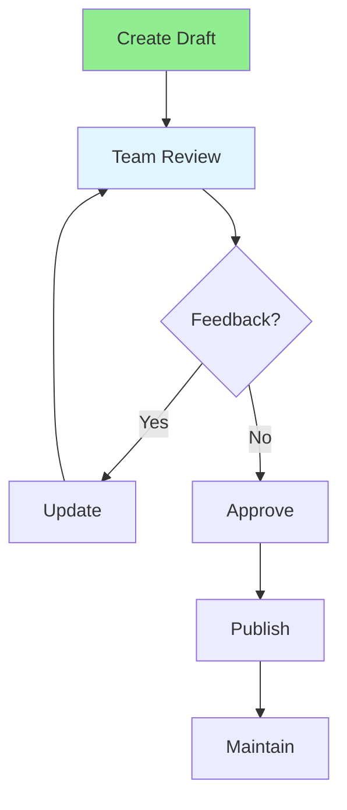

# 10.08 Documentation Collaboration / Cộng tác tài liệu

## Table of Contents / Mục lục
1. [Introduction / Giới thiệu](#introduction--giới-thiệu)
2. [Documentation Types / Loại tài liệu](#documentation-types--loại-tài-liệu)
3. [Collaborative Writing / Viết cộng tác](#collaborative-writing--viết-cộng-tác)
4. [Best Practices / Thực hành tốt nhất](#best-practices--thực-hành-tốt-nhất)
5. [Summary / Tóm tắt](#summary--tóm-tắt)

---

## Introduction / Giới thiệu

### Overview / Tổng quan

**English**: Collaborative documentation ensures knowledge is shared and maintained. Learn to write, review, and maintain documentation as a team.

**Vietnamese**: Tài liệu cộng tác đảm bảo kiến thức được chia sẻ và duy trì. Học cách viết, review và duy trì tài liệu như một nhóm.

### Documentation Collaboration Flow / Luồng cộng tác tài liệu



---

## Documentation Types / Loại tài liệu

### Example 1: Documentation Structure / Ví dụ 1: Cấu trúc tài liệu

```typescript
// Documentation types / Loại tài liệu
enum DocumentationType {
  API = 'api', // API documentation / Tài liệu API
  ARCHITECTURE = 'architecture', // Architecture docs / Tài liệu kiến trúc
  USER_GUIDE = 'user_guide', // User guides / Hướng dẫn người dùng
  README = 'readme', // README files / File README
  CHANGELOG = 'changelog' // Changelog / Nhật ký thay đổi
}

interface Documentation {
  type: DocumentationType;
  title: string;
  content: string;
  authors: string[];
  reviewers: string[];
  lastUpdated: Date;
  version: string;
}

// Documentation template / Mẫu tài liệu
function createDocumentationTemplate(type: DocumentationType): string {
  const templates = {
    [DocumentationType.API]: `
# API Documentation

## Endpoints
- GET /api/users
- POST /api/users

## Authentication
Bearer token required
    `,
    [DocumentationType.README]: `
# Project Name

## Description
Brief description

## Installation
\`\`\`bash
npm install
\`\`\`

## Usage
How to use

## Contributing
Guidelines
    `
  };
  
  return templates[type] || '';
}
```

---

## Collaborative Writing / Viết cộng tác

### Example 2: Documentation Review Process / Ví dụ 2: Quy trình review tài liệu

```typescript
// Documentation review / Review tài liệu
interface DocReview {
  document: Documentation;
  reviewer: string;
  comments: DocComment[];
  status: 'pending' | 'approved' | 'changes_requested';
}

interface DocComment {
  section: string;
  comment: string;
  suggestion?: string;
  resolved: boolean;
}

// Review documentation / Review tài liệu
async function reviewDocumentation(
  doc: Documentation,
  reviewer: string
): Promise<DocReview> {
  // Review content / Review nội dung
  const comments = await analyzeDocumentation(doc);
  
  return {
    document: doc,
    reviewer,
    comments,
    status: comments.length === 0 ? 'approved' : 'changes_requested'
  };
}
```

---

## Best Practices / Thực hành tốt nhất

1. **Keep updated** - Update docs with code changes
2. **Be clear** - Write for your audience
3. **Use examples** - Include code examples
4. **Review regularly** - Schedule doc reviews
5. **Version control** - Track doc changes

---

## Summary / Tóm tắt

### Key Takeaways / Điểm chính

- **Types**: API, architecture, guides, README
- **Collaboration**: Review and update together
- **Clarity**: Write clearly for audience
- **Maintenance**: Keep docs current

### Next Steps / Bước tiếp theo

- [10.09 Task Assignment](./10.09_Task_Assignment.md) - Next: Task Assignment

---

**Last Updated / Cập nhật lần cuối**: 2024


