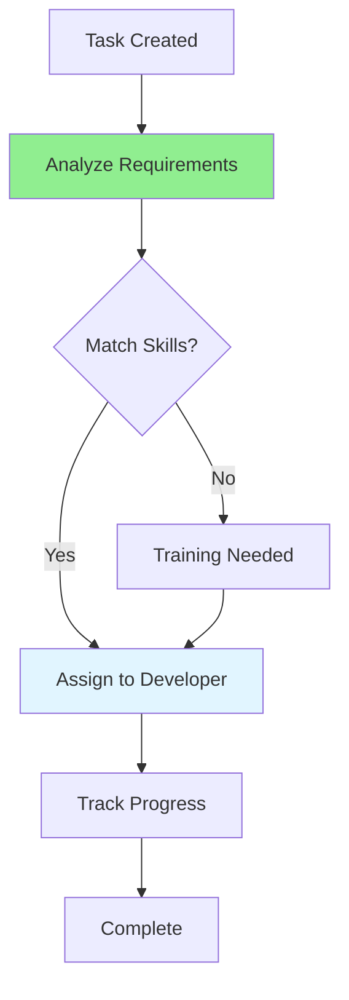

# 10.09 Task Assignment / Phân công nhiệm vụ

## Table of Contents / Mục lục
1. [Introduction / Giới thiệu](#introduction--giới-thiệu)
2. [Assignment Process / Quy trình phân công](#assignment-process--quy-trình-phân-công)
3. [Task Tracking / Theo dõi nhiệm vụ](#task-tracking--theo-dõi-nhiệm-vụ)
4. [Best Practices / Thực hành tốt nhất](#best-practices--thực-hành-tốt-nhất)
5. [Summary / Tóm tắt](#summary--tóm-tắt)

---

## Introduction / Giới thiệu

### Overview / Tổng quan

**English**: Effective task assignment ensures work is distributed fairly and completed efficiently. Learn to assign tasks based on skills, availability, and workload.

**Vietnamese**: Phân công nhiệm vụ hiệu quả đảm bảo công việc được phân bổ công bằng và hoàn thành hiệu quả. Học cách phân công dựa trên kỹ năng, khả năng và khối lượng công việc.

### Task Assignment Flow / Luồng phân công nhiệm vụ



---

## Assignment Process / Quy trình phân công

### Example 1: Task Assignment System / Ví dụ 1: Hệ thống phân công nhiệm vụ

```typescript
// Task assignment / Phân công nhiệm vụ
interface Task {
  id: string;
  title: string;
  description: string;
  priority: 'low' | 'medium' | 'high' | 'critical';
  estimatedHours: number;
  requiredSkills: string[];
  assignee?: string;
  status: 'todo' | 'in_progress' | 'done';
}

interface Developer {
  id: string;
  name: string;
  skills: string[];
  currentWorkload: number; // hours / giờ
  maxWorkload: number; // hours / giờ
}

// Assign task to developer / Phân công nhiệm vụ cho developer
function assignTask(task: Task, developers: Developer[]): Developer | null {
  // Find developers with required skills / Tìm developer có kỹ năng cần thiết
  const qualified = developers.filter(dev =>
    task.requiredSkills.every(skill => dev.skills.includes(skill))
  );
  
  if (qualified.length === 0) {
    return null; // No qualified developer / Không có developer phù hợp
  }
  
  // Find developer with lowest workload / Tìm developer có khối lượng công việc thấp nhất
  const available = qualified.filter(dev =>
    dev.currentWorkload + task.estimatedHours <= dev.maxWorkload
  );
  
  if (available.length === 0) {
    return null; // No available developer / Không có developer có sẵn
  }
  
  // Assign to developer with lowest workload / Phân công cho developer có khối lượng công việc thấp nhất
  return available.reduce((min, dev) =>
    dev.currentWorkload < min.currentWorkload ? dev : min
  );
}
```

---

## Task Tracking / Theo dõi nhiệm vụ

### Example 2: Task Status Tracking / Ví dụ 2: Theo dõi trạng thái nhiệm vụ

```typescript
// Task status tracking / Theo dõi trạng thái nhiệm vụ
class TaskTracker {
  private tasks: Map<string, Task> = new Map();
  
  // Update task status / Cập nhật trạng thái nhiệm vụ
  updateStatus(taskId: string, status: Task['status']): void {
    const task = this.tasks.get(taskId);
    if (task) {
      task.status = status;
      this.tasks.set(taskId, task);
    }
  }
  
  // Get tasks by assignee / Lấy nhiệm vụ theo người được phân công
  getTasksByAssignee(assignee: string): Task[] {
    return Array.from(this.tasks.values())
      .filter(task => task.assignee === assignee);
  }
  
  // Get workload for developer / Lấy khối lượng công việc cho developer
  getWorkload(assignee: string): number {
    return this.getTasksByAssignee(assignee)
      .filter(task => task.status !== 'done')
      .reduce((sum, task) => sum + task.estimatedHours, 0);
  }
}
```

---

## Best Practices / Thực hành tốt nhất

1. **Match skills** - Assign based on expertise
2. **Balance workload** - Distribute evenly
3. **Consider availability** - Check capacity
4. **Provide context** - Give clear instructions
5. **Track progress** - Monitor completion

---

## Summary / Tóm tắt

### Key Takeaways / Điểm chính

- **Skills**: Match tasks to developer skills
- **Workload**: Balance distribution
- **Tracking**: Monitor progress
- **Communication**: Provide clear context

### Next Steps / Bước tiếp theo

- [10.10 Progress Reporting](./10.10_Progress_Reporting.md) - Next: Progress Reporting

---

**Last Updated / Cập nhật lần cuối**: 2024

