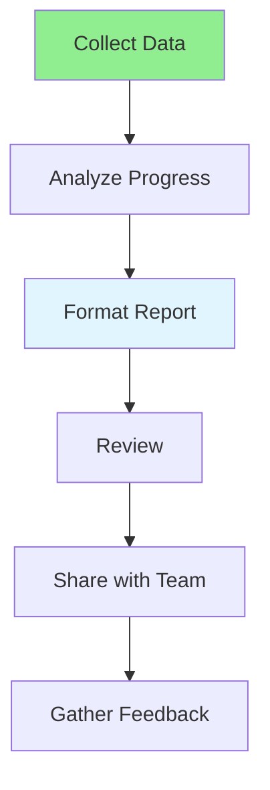

# 10.10 Progress Reporting / Báo cáo tiến độ

## Table of Contents / Mục lục
1. [Introduction / Giới thiệu](#introduction--giới-thiệu)
2. [Reporting Formats / Định dạng báo cáo](#reporting-formats--định-dạng-báo-cáo)
3. [Progress Metrics / Chỉ số tiến độ](#progress-metrics--chỉ-số-tiến-độ)
4. [Best Practices / Thực hành tốt nhất](#best-practices--thực-hành-tốt-nhất)
5. [Summary / Tóm tắt](#summary--tóm-tắt)

---

## Introduction / Giới thiệu

### Overview / Tổng quan

**English**: Regular progress reporting keeps stakeholders informed and helps identify issues early. Learn to create clear, concise progress reports.

**Vietnamese**: Báo cáo tiến độ thường xuyên giữ cho các bên liên quan được thông tin và giúp xác định vấn đề sớm. Học cách tạo báo cáo tiến độ rõ ràng, ngắn gọn.

### Progress Reporting Flow / Luồng báo cáo tiến độ



---

## Reporting Formats / Định dạng báo cáo

### Example 1: Progress Report Template / Ví dụ 1: Mẫu báo cáo tiến độ

```typescript
// Progress report structure / Cấu trúc báo cáo tiến độ
interface ProgressReport {
  period: string; // e.g., "Week 1" / Ví dụ: "Tuần 1"
  date: Date;
  completed: Task[];
  inProgress: Task[];
  blocked: Task[];
  metrics: ProgressMetrics;
}

interface ProgressMetrics {
  tasksCompleted: number;
  tasksInProgress: number;
  tasksBlocked: number;
  completionRate: number; // percentage / phần trăm
  velocity: number; // story points / điểm story
}

// Generate progress report / Tạo báo cáo tiến độ
function generateProgressReport(tasks: Task[]): ProgressReport {
  const completed = tasks.filter(t => t.status === 'done');
  const inProgress = tasks.filter(t => t.status === 'in_progress');
  const blocked = tasks.filter(t => t.status === 'blocked');
  
  return {
    period: `Week ${getWeekNumber()}`,
    date: new Date(),
    completed,
    inProgress,
    blocked,
    metrics: {
      tasksCompleted: completed.length,
      tasksInProgress: inProgress.length,
      tasksBlocked: blocked.length,
      completionRate: (completed.length / tasks.length) * 100,
      velocity: completed.reduce((sum, t) => sum + (t.storyPoints || 0), 0)
    }
  };
}
```

---

## Progress Metrics / Chỉ số tiến độ

### Example 2: Progress Visualization / Ví dụ 2: Trực quan hóa tiến độ

```typescript
// Progress metrics calculation / Tính toán chỉ số tiến độ
class ProgressTracker {
  calculateMetrics(tasks: Task[]): ProgressMetrics {
    const total = tasks.length;
    const completed = tasks.filter(t => t.status === 'done').length;
    const inProgress = tasks.filter(t => t.status === 'in_progress').length;
    const blocked = tasks.filter(t => t.status === 'blocked').length;
    
    return {
      tasksCompleted: completed,
      tasksInProgress: inProgress,
      tasksBlocked: blocked,
      completionRate: (completed / total) * 100,
      velocity: this.calculateVelocity(tasks)
    };
  }
  
  private calculateVelocity(tasks: Task[]): number {
    const completed = tasks.filter(t => t.status === 'done');
    return completed.reduce((sum, t) => sum + (t.storyPoints || 0), 0);
  }
}
```

---

## Best Practices / Thực hành tốt nhất

1. **Report regularly** - Daily or weekly updates
2. **Be honest** - Report actual progress
3. **Highlight blockers** - Identify issues early
4. **Use metrics** - Quantify progress
5. **Keep concise** - Focus on key points

---

## Summary / Tóm tắt

### Key Takeaways / Điểm chính

- **Regularity**: Report consistently
- **Accuracy**: Report actual progress
- **Metrics**: Use quantifiable data
- **Clarity**: Keep reports clear and concise

### Next Steps / Bước tiếp theo

- [10.11 Knowledge Sharing](./10.11_Knowledge_Sharing.md) - Next: Knowledge Sharing

---

**Last Updated / Cập nhật lần cuối**: 2024

