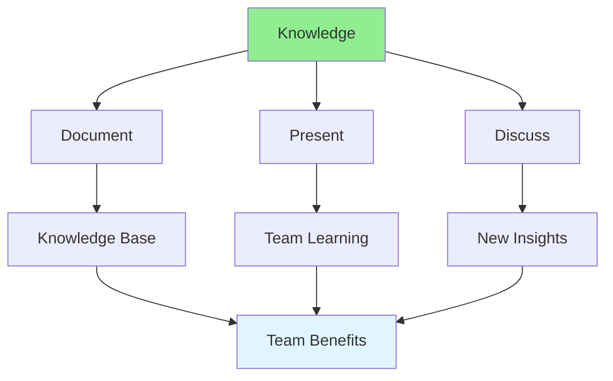

# 10.11 Knowledge Sharing / Chia sẻ kiến thức

## Table of Contents / Mục lục
1. [Introduction / Giới thiệu](#introduction--giới-thiệu)
2. [Sharing Methods / Phương pháp chia sẻ](#sharing-methods--phương-pháp-chia-sẻ)
3. [Knowledge Base / Cơ sở kiến thức](#knowledge-base--cơ-sở-kiến-thức)
4. [Best Practices / Thực hành tốt nhất](#best-practices--thực-hành-tốt-nhất)
5. [Summary / Tóm tắt](#summary--tóm-tắt)

---

## Introduction / Giới thiệu

### Overview / Tổng quan

**English**: Knowledge sharing strengthens the team and improves collective expertise. Learn to share knowledge through documentation, presentations, and discussions.

**Vietnamese**: Chia sẻ kiến thức tăng cường nhóm và cải thiện chuyên môn tập thể. Học cách chia sẻ kiến thức qua tài liệu, trình bày và thảo luận.

### Knowledge Sharing Flow / Luồng chia sẻ kiến thức



---

## Sharing Methods / Phương pháp chia sẻ

### Example 1: Knowledge Sharing Platform / Ví dụ 1: Nền tảng chia sẻ kiến thức

```typescript
// Knowledge sharing system / Hệ thống chia sẻ kiến thức
interface KnowledgeArticle {
  id: string;
  title: string;
  content: string;
  author: string;
  tags: string[];
  category: 'technical' | 'process' | 'tool' | 'best_practice';
  createdAt: Date;
  updatedAt: Date;
  views: number;
  helpful: number;
}

// Create knowledge article / Tạo bài viết kiến thức
function createKnowledgeArticle(
  title: string,
  content: string,
  author: string,
  tags: string[],
  category: KnowledgeArticle['category']
): KnowledgeArticle {
  return {
    id: generateId(),
    title,
    content,
    author,
    tags,
    category,
    createdAt: new Date(),
    updatedAt: new Date(),
    views: 0,
    helpful: 0
  };
}

// Search knowledge base / Tìm kiếm cơ sở kiến thức
function searchKnowledge(
  articles: KnowledgeArticle[],
  query: string
): KnowledgeArticle[] {
  const lowerQuery = query.toLowerCase();
  return articles.filter(article =>
    article.title.toLowerCase().includes(lowerQuery) ||
    article.content.toLowerCase().includes(lowerQuery) ||
    article.tags.some(tag => tag.toLowerCase().includes(lowerQuery))
  );
}
```

---

## Knowledge Base / Cơ sở kiến thức

### Example 2: Knowledge Base Structure / Ví dụ 2: Cấu trúc cơ sở kiến thức

```typescript
// Knowledge base categories / Danh mục cơ sở kiến thức
enum KnowledgeCategory {
  ARCHITECTURE = 'architecture',
  FRONTEND = 'frontend',
  BACKEND = 'backend',
  DATABASE = 'database',
  DEVOPS = 'devops',
  TESTING = 'testing',
  TOOLS = 'tools'
}

// Organize knowledge / Tổ chức kiến thức
class KnowledgeBase {
  private articles: Map<string, KnowledgeArticle[]> = new Map();
  
  // Add article / Thêm bài viết
  addArticle(article: KnowledgeArticle): void {
    const category = article.category;
    if (!this.articles.has(category)) {
      this.articles.set(category, []);
    }
    this.articles.get(category)!.push(article);
  }
  
  // Get articles by category / Lấy bài viết theo danh mục
  getArticlesByCategory(category: string): KnowledgeArticle[] {
    return this.articles.get(category) || [];
  }
  
  // Get popular articles / Lấy bài viết phổ biến
  getPopularArticles(limit: number = 10): KnowledgeArticle[] {
    const allArticles = Array.from(this.articles.values()).flat();
    return allArticles
      .sort((a, b) => b.helpful - a.helpful)
      .slice(0, limit);
  }
}
```

---

## Best Practices / Thực hành tốt nhất

1. **Document regularly** - Share as you learn
2. **Use examples** - Include code examples
3. **Keep updated** - Update outdated content
4. **Encourage questions** - Foster discussion
5. **Make searchable** - Tag and categorize

---

## Summary / Tóm tắt

### Key Takeaways / Điểm chính

- **Methods**: Documentation, presentations, discussions
- **Organization**: Categorize and tag content
- **Accessibility**: Make knowledge searchable
- **Culture**: Encourage sharing

### Next Steps / Bước tiếp theo

- [10.12 Mentoring](./10.12_Mentoring.md) - Next: Mentoring

---

**Last Updated / Cập nhật lần cuối**: 2024


