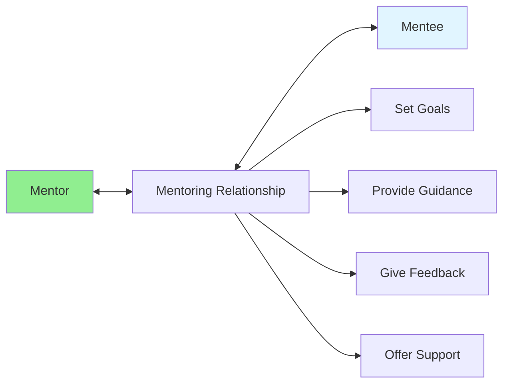

# 10.12 Mentoring / Cố vấn

## Table of Contents / Mục lục
1. [Introduction / Giới thiệu](#introduction--giới-thiệu)
2. [Mentoring Roles / Vai trò cố vấn](#mentoring-roles--vai-trò-cố-vấn)
3. [Mentoring Process / Quy trình cố vấn](#mentoring-process--quy-trình-cố-vấn)
4. [Best Practices / Thực hành tốt nhất](#best-practices--thực-hành-tốt-nhất)
5. [Summary / Tóm tắt](#summary--tóm-tắt)

---

## Introduction / Giới thiệu

### Overview / Tổng quan

**English**: Mentoring accelerates learning and career development. Learn to be an effective mentor and mentee, sharing knowledge and experience.

**Vietnamese**: Cố vấn tăng tốc học tập và phát triển sự nghiệp. Học cách trở thành mentor và mentee hiệu quả, chia sẻ kiến thức và kinh nghiệm.

### Mentoring Relationship / Mối quan hệ cố vấn



---

## Mentoring Roles / Vai trò cố vấn

### Example 1: Mentoring Structure / Ví dụ 1: Cấu trúc cố vấn

```typescript
// Mentoring relationship / Mối quan hệ cố vấn
interface MentoringRelationship {
  mentor: string;
  mentee: string;
  startDate: Date;
  goals: string[];
  meetings: MentoringMeeting[];
  status: 'active' | 'completed';
}

interface MentoringMeeting {
  date: Date;
  agenda: string[];
  discussion: string;
  actionItems: string[];
  nextMeeting?: Date;
}

// Create mentoring relationship / Tạo mối quan hệ cố vấn
function createMentoringRelationship(
  mentor: string,
  mentee: string,
  goals: string[]
): MentoringRelationship {
  return {
    mentor,
    mentee,
    startDate: new Date(),
    goals,
    meetings: [],
    status: 'active'
  };
}

// Schedule mentoring meeting / Lên lịch cuộc họp cố vấn
function scheduleMentoringMeeting(
  relationship: MentoringRelationship,
  agenda: string[]
): MentoringMeeting {
  const meeting: MentoringMeeting = {
    date: new Date(),
    agenda,
    discussion: '',
    actionItems: []
  };
  
  relationship.meetings.push(meeting);
  return meeting;
}
```

---

## Mentoring Process / Quy trình cố vấn

### Example 2: Mentoring Goals / Ví dụ 2: Mục tiêu cố vấn

```typescript
// Mentoring goals / Mục tiêu cố vấn
interface MentoringGoal {
  id: string;
  description: string;
  targetDate: Date;
  progress: number; // 0-100 / 0-100
  milestones: string[];
  completed: boolean;
}

// Track mentoring progress / Theo dõi tiến độ cố vấn
class MentoringTracker {
  private goals: MentoringGoal[] = [];
  
  // Add goal / Thêm mục tiêu
  addGoal(goal: MentoringGoal): void {
    this.goals.push(goal);
  }
  
  // Update progress / Cập nhật tiến độ
  updateProgress(goalId: string, progress: number): void {
    const goal = this.goals.find(g => g.id === goalId);
    if (goal) {
      goal.progress = Math.min(100, Math.max(0, progress));
      goal.completed = goal.progress === 100;
    }
  }
  
  // Get active goals / Lấy mục tiêu đang hoạt động
  getActiveGoals(): MentoringGoal[] {
    return this.goals.filter(g => !g.completed);
  }
}
```

---

## Best Practices / Thực hành tốt nhất

1. **Set clear goals** - Define learning objectives
2. **Regular meetings** - Schedule consistent sessions
3. **Provide feedback** - Give constructive feedback
4. **Be patient** - Allow time for learning
5. **Encourage questions** - Foster curiosity

---

## Summary / Tóm tắt

### Key Takeaways / Điểm chính

- **Roles**: Mentor and mentee responsibilities
- **Goals**: Set clear learning objectives
- **Meetings**: Regular check-ins
- **Growth**: Support development

### Next Steps / Bước tiếp theo

- [10.13 Remote Collaboration](./10.13_Remote_Collaboration.md) - Next: Remote Collaboration

---

**Last Updated / Cập nhật lần cuối**: 2024


