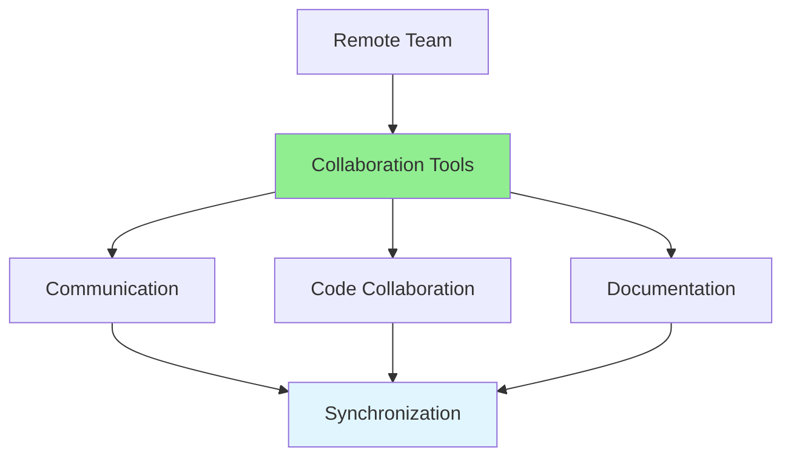

# 10.13 Remote Collaboration / Cộng tác từ xa

## Table of Contents / Mục lục
1. [Introduction / Giới thiệu](#introduction--giới-thiệu)
2. [Remote Tools / Công cụ từ xa](#remote-tools--công-cụ-từ-xa)
3. [Best Practices / Thực hành tốt nhất](#best-practices--thực-hành-tốt-nhất)
4. [Summary / Tóm tắt](#summary--tóm-tắt)

---

## Introduction / Giới thiệu

### Overview / Tổng quan

**English**: Remote collaboration requires effective use of tools and communication. Learn to work effectively with distributed teams.

**Vietnamese**: Cộng tác từ xa yêu cầu sử dụng công cụ và giao tiếp hiệu quả. Học cách làm việc hiệu quả với nhóm phân tán.

### Remote Collaboration Flow / Luồng cộng tác từ xa



---

## Remote Tools / Công cụ từ xa

### Example 1: Remote Collaboration Setup / Ví dụ 1: Thiết lập cộng tác từ xa

```typescript
// Remote collaboration tools / Công cụ cộng tác từ xa
interface RemoteTools {
  communication: 'Slack' | 'Teams' | 'Discord';
  video: 'Zoom' | 'Meet' | 'Teams';
  code: 'GitHub' | 'GitLab' | 'Bitbucket';
  project: 'Jira' | 'Trello' | 'Asana';
  docs: 'Confluence' | 'Notion' | 'Google Docs';
}

// Remote work best practices / Thực hành tốt nhất làm việc từ xa
const remoteBestPractices = {
  communication: [
    'Use async communication for non-urgent matters',
    'Schedule regular sync meetings',
    'Document decisions in shared spaces',
    'Use video for important discussions'
  ],
  code: [
    'Use clear commit messages',
    'Create detailed PR descriptions',
    'Respond to reviews promptly',
    'Keep branches up to date'
  ],
  timezones: [
    'Respect timezone differences',
    'Schedule meetings at convenient times',
    'Use async communication when possible',
    'Document work for different timezones'
  ]
};
```

---

## Best Practices / Thực hành tốt nhất

1. **Over-communicate** - Share more information
2. **Use video** - Face-to-face when possible
3. **Document everything** - Write things down
4. **Respect timezones** - Consider global team
5. **Build relationships** - Connect personally

---

## Summary / Tóm tắt

### Key Takeaways / Điểm chính

- **Tools**: Use appropriate collaboration tools
- **Communication**: Over-communicate
- **Documentation**: Document thoroughly
- **Timezones**: Respect differences

### Next Steps / Bước tiếp theo

- [10.14 Team Culture](./10.14_Team_Culture.md) - Next: Team Culture

---

**Last Updated / Cập nhật lần cuối**: 2024

