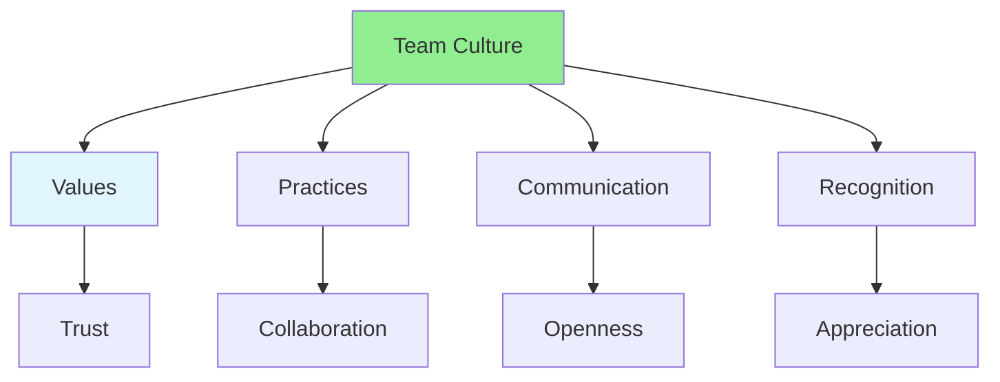

# 10.14 Team Culture / Văn hóa nhóm

## Table of Contents / Mục lục
1. [Introduction / Giới thiệu](#introduction--giới-thiệu)
2. [Culture Elements / Yếu tố văn hóa](#culture-elements--yếu-tố-văn-hóa)
3. [Building Culture / Xây dựng văn hóa](#building-culture--xây-dựng-văn-hóa)
4. [Best Practices / Thực hành tốt nhất](#best-practices--thực-hành-tốt-nhất)
5. [Summary / Tóm tắt](#summary--tóm-tắt)

---

## Introduction / Giới thiệu

### Overview / Tổng quan

**English**: Strong team culture improves collaboration and productivity. Learn to build and maintain a positive, inclusive team culture.

**Vietnamese**: Văn hóa nhóm mạnh cải thiện cộng tác và năng suất. Học cách xây dựng và duy trì văn hóa nhóm tích cực, bao trùm.

### Team Culture Elements / Yếu tố văn hóa nhóm



---

## Culture Elements / Yếu tố văn hóa

### Example 1: Team Values / Ví dụ 1: Giá trị nhóm

```typescript
// Team culture values / Giá trị văn hóa nhóm
interface TeamValues {
  transparency: boolean; // Open communication / Giao tiếp mở
  collaboration: boolean; // Work together / Làm việc cùng nhau
  learning: boolean; // Continuous learning / Học liên tục
  respect: boolean; // Respect each other / Tôn trọng lẫn nhau
  ownership: boolean; // Take ownership / Chịu trách nhiệm
}

// Team culture practices / Thực hành văn hóa nhóm
const teamCulturePractices = {
  codeReview: {
    principle: 'Constructive feedback',
    practice: 'Focus on code, not person'
  },
  meetings: {
    principle: 'Inclusive participation',
    practice: 'Encourage all voices'
  },
  learning: {
    principle: 'Knowledge sharing',
    practice: 'Regular tech talks'
  },
  recognition: {
    principle: 'Celebrate wins',
    practice: 'Acknowledge contributions'
  }
};
```

---

## Building Culture / Xây dựng văn hóa

### Example 2: Culture Building Activities / Ví dụ 2: Hoạt động xây dựng văn hóa

```typescript
// Culture building activities / Hoạt động xây dựng văn hóa
interface CultureActivity {
  type: 'meeting' | 'event' | 'ritual' | 'practice';
  name: string;
  frequency: 'daily' | 'weekly' | 'monthly' | 'quarterly';
  description: string;
}

const cultureActivities: CultureActivity[] = [
  {
    type: 'meeting',
    name: 'Daily Standup',
    frequency: 'daily',
    description: 'Share progress and blockers'
  },
  {
    type: 'event',
    name: 'Tech Talk',
    frequency: 'weekly',
    description: 'Share knowledge and learn'
  },
  {
    type: 'ritual',
    name: 'Retrospective',
    frequency: 'monthly',
    description: 'Reflect and improve'
  },
  {
    type: 'practice',
    name: 'Code Review',
    frequency: 'daily',
    description: 'Collaborate on code quality'
  }
];
```

---

## Best Practices / Thực hành tốt nhất

1. **Define values** - Establish team values
2. **Practice consistently** - Regular activities
3. **Lead by example** - Model desired behavior
4. **Celebrate success** - Recognize achievements
5. **Learn together** - Foster learning culture

---

## Summary / Tóm tắt

### Key Takeaways / Điểm chính

- **Values**: Define and practice team values
- **Practices**: Regular culture-building activities
- **Inclusion**: Foster inclusive environment
- **Growth**: Support team development

### Next Steps / Bước tiếp theo

- [10.15 Project Handoff](./10.15_Project_Handoff.md) - Next: Project Handoff

---

**Last Updated / Cập nhật lần cuối**: 2024


