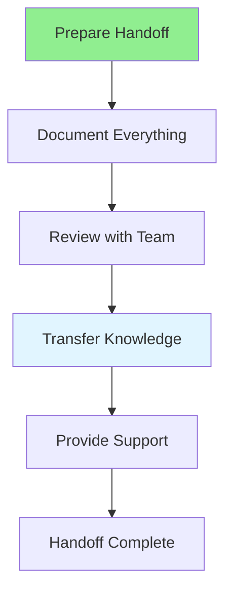

# 10.15 Project Handoff / Bàn giao dự án

## Table of Contents / Mục lục
1. [Introduction / Giới thiệu](#introduction--giới-thiệu)
2. [Handoff Process / Quy trình bàn giao](#handoff-process--quy-trình-bàn-giao)
3. [Documentation / Tài liệu](#documentation--tài-liệu)
4. [Best Practices / Thực hành tốt nhất](#best-practices--thực-hành-tốt-nhất)
5. [Summary / Tóm tắt](#summary--tóm-tắt)

---

## Introduction / Giới thiệu

### Overview / Tổng quan

**English**: Project handoff ensures smooth transition when transferring project ownership. Learn to document, communicate, and transfer knowledge effectively.

**Vietnamese**: Bàn giao dự án đảm bảo chuyển giao mượt mà khi chuyển quyền sở hữu dự án. Học cách tài liệu hóa, giao tiếp và chuyển giao kiến thức hiệu quả.

### Project Handoff Flow / Luồng bàn giao dự án



---

## Handoff Process / Quy trình bàn giao

### Example 1: Handoff Checklist / Ví dụ 1: Danh sách kiểm tra bàn giao

```typescript
// Project handoff checklist / Danh sách kiểm tra bàn giao dự án
interface HandoffChecklist {
  documentation: {
    architecture: boolean;
    api: boolean;
    deployment: boolean;
    troubleshooting: boolean;
  };
  code: {
    repository: boolean;
    access: boolean;
    documentation: boolean;
    tests: boolean;
  };
  infrastructure: {
    access: boolean;
    credentials: boolean;
    monitoring: boolean;
    backups: boolean;
  };
  knowledge: {
    training: boolean;
    qa: boolean;
    runbook: boolean;
    contacts: boolean;
  };
}

// Handoff document / Tài liệu bàn giao
interface HandoffDocument {
  project: string;
  from: string;
  to: string;
  date: Date;
  checklist: HandoffChecklist;
  documentation: {
    architecture: string;
    deployment: string;
    troubleshooting: string;
  };
  contacts: {
    technical: string[];
    business: string[];
  };
  nextSteps: string[];
}
```

---

## Documentation / Tài liệu

### Example 2: Handoff Documentation Template / Ví dụ 2: Mẫu tài liệu bàn giao

```typescript
// Create handoff documentation / Tạo tài liệu bàn giao
function createHandoffDocument(
  project: string,
  from: string,
  to: string
): HandoffDocument {
  return {
    project,
    from,
    to,
    date: new Date(),
    checklist: {
      documentation: {
        architecture: false,
        api: false,
        deployment: false,
        troubleshooting: false
      },
      code: {
        repository: false,
        access: false,
        documentation: false,
        tests: false
      },
      infrastructure: {
        access: false,
        credentials: false,
        monitoring: false,
        backups: false
      },
      knowledge: {
        training: false,
        qa: false,
        runbook: false,
        contacts: false
      }
    },
    documentation: {
      architecture: 'Architecture overview...',
      deployment: 'Deployment instructions...',
      troubleshooting: 'Common issues and solutions...'
    },
    contacts: {
      technical: [],
      business: []
    },
    nextSteps: [
      'Schedule knowledge transfer session',
      'Provide access to systems',
      'Review documentation together'
    ]
  };
}
```

---

## Best Practices / Thực hành tốt nhất

1. **Start early** - Begin handoff preparation early
2. **Document thoroughly** - Include all necessary info
3. **Transfer knowledge** - Conduct training sessions
4. **Provide support** - Be available for questions
5. **Follow up** - Check in after handoff

---

## Summary / Tóm tắt

### Key Takeaways / Điểm chính

- **Preparation**: Start early and plan thoroughly
- **Documentation**: Comprehensive handoff docs
- **Knowledge Transfer**: Training and Q&A sessions
- **Support**: Available for questions

### Next Steps / Bước tiếp theo

- Complete Group 10: Team Collaboration ✅
- Move to [Group 11: Agile & Scrum](../Group-11-Agile-Scrum/) - Coming next

---

**Last Updated / Cập nhật lần cuối**: 2024


