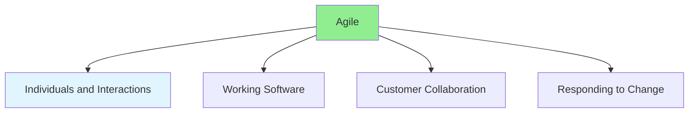

# 11.01 Agile Principles / Nguyên tắc Agile

## Table of Contents / Mục lục
1. [Introduction / Giới thiệu](#introduction--giới-thiệu)
2. [Agile Manifesto / Tuyên ngôn Agile](#agile-manifesto--tuyên-ngôn-agile)
3. [Agile Principles / Nguyên tắc Agile](#agile-principles--nguyên-tắc-agile)
4. [Best Practices / Thực hành tốt nhất](#best-practices--thực-hành-tốt-nhất)
5. [Summary / Tóm tắt](#summary--tóm-tắt)

---

## Introduction / Giới thiệu

### Overview / Tổng quan

**English**: Agile is a mindset and set of principles for software development. Understand the Agile Manifesto, core principles, and how they guide development practices.

**Vietnamese**: Agile là tư duy và tập hợp nguyên tắc cho phát triển phần mềm. Hiểu Tuyên ngôn Agile, nguyên tắc cốt lõi và cách chúng hướng dẫn thực hành phát triển.

### Agile Values / Giá trị Agile



---

## Agile Manifesto / Tuyên ngôn Agile

### Example 1: Agile Values / Ví dụ 1: Giá trị Agile

```typescript
// Agile Manifesto values / Giá trị Tuyên ngôn Agile
interface AgileValues {
  // Valued more / Được đánh giá cao hơn
  individuals: 'Individuals and interactions over processes and tools';
  working: 'Working software over comprehensive documentation';
  collaboration: 'Customer collaboration over contract negotiation';
  response: 'Responding to change over following a plan';
  
  // While still valuing / Trong khi vẫn đánh giá
  processes: 'Processes and tools are important';
  documentation: 'Documentation is important';
  contracts: 'Contracts are important';
  plans: 'Plans are important';
}

// Agile principles / Nguyên tắc Agile
const agilePrinciples = [
  'Satisfy customer through early delivery',
  'Welcome changing requirements',
  'Deliver working software frequently',
  'Business and developers work together',
  'Build projects around motivated individuals',
  'Face-to-face conversation is most effective',
  'Working software is primary measure',
  'Sustainable development pace',
  'Continuous attention to technical excellence',
  'Simplicity is essential',
  'Self-organizing teams',
  'Regular reflection and adjustment'
];
```

---

## Agile Principles / Nguyên tắc Agile

### Example 2: Applying Agile Principles / Ví dụ 2: Áp dụng nguyên tắc Agile

```typescript
// Agile development practices / Thực hành phát triển Agile
class AgileDevelopment {
  // Principle: Deliver working software frequently / Nguyên tắc: Giao phần mềm hoạt động thường xuyên
  deliverFrequently(features: Feature[]): void {
    // Release small increments / Phát hành tăng dần nhỏ
    features.forEach(feature => {
      if (feature.isComplete()) {
        this.deploy(feature);
      }
    });
  }
  
  // Principle: Welcome changing requirements / Nguyên tắc: Chào đón thay đổi yêu cầu
  adaptToChange(requirement: Requirement): void {
    // Update backlog and plan / Cập nhật backlog và kế hoạch
    this.backlog.update(requirement);
    this.replan();
  }
  
  // Principle: Business and developers work together / Nguyên tắc: Business và developer làm việc cùng nhau
  collaborateWithBusiness(): void {
    // Regular meetings and communication / Cuộc họp và giao tiếp thường xuyên
    this.scheduleDailyStandup();
    this.scheduleSprintReview();
  }
}
```

---

## Best Practices / Thực hành tốt nhất

1. **Embrace change** - Welcome changing requirements
2. **Deliver frequently** - Release working software often
3. **Collaborate** - Work closely with stakeholders
4. **Focus on value** - Prioritize customer value
5. **Reflect regularly** - Improve continuously

---

## Summary / Tóm tắt

### Key Takeaways / Điểm chính

- **Values**: Individuals, working software, collaboration, response to change
- **Principles**: 12 core Agile principles
- **Mindset**: Flexibility and adaptation
- **Practice**: Apply principles in daily work

### Next Steps / Bước tiếp theo

- [11.02 Scrum Framework](./11.02_Scrum_Framework.md) - Next: Scrum Framework

---

**Last Updated / Cập nhật lần cuối**: 2024


