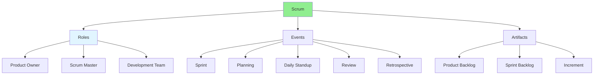

# 11.02 Scrum Framework / Framework Scrum

## Table of Contents / Mục lục
1. [Introduction / Giới thiệu](#introduction--giới-thiệu)
2. [Scrum Components / Thành phần Scrum](#scrum-components--thành-phần-scrum)
3. [Scrum Events / Sự kiện Scrum](#scrum-events--sự-kiện-scrum)
4. [Best Practices / Thực hành tốt nhất](#best-practices--thực-hành-tốt-nhất)
5. [Summary / Tóm tắt](#summary--tóm-tắt)

---

## Introduction / Giới thiệu

### Overview / Tổng quan

**English**: Scrum is an Agile framework for managing complex projects. Learn Scrum roles, events, artifacts, and how they work together.

**Vietnamese**: Scrum là framework Agile để quản lý dự án phức tạp. Học vai trò, sự kiện, tạo phẩm Scrum và cách chúng hoạt động cùng nhau.

### Scrum Framework / Framework Scrum



---

## Scrum Components / Thành phần Scrum

### Example 1: Scrum Structure / Ví dụ 1: Cấu trúc Scrum

```typescript
// Scrum framework components / Thành phần framework Scrum
interface ScrumFramework {
  roles: {
    productOwner: 'Defines requirements and priorities';
    scrumMaster: 'Facilitates Scrum process';
    developmentTeam: 'Builds the product';
  };
  events: {
    sprint: 'Time-boxed iteration (1-4 weeks)';
    sprintPlanning: 'Plan sprint work';
    dailyScrum: 'Daily 15-minute sync';
    sprintReview: 'Review completed work';
    sprintRetrospective: 'Reflect and improve';
  };
  artifacts: {
    productBacklog: 'Prioritized list of features';
    sprintBacklog: 'Work selected for sprint';
    increment: 'Working product increment';
  };
}

// Sprint structure / Cấu trúc Sprint
interface Sprint {
  number: number;
  duration: number; // weeks / tuần
  goal: string;
  startDate: Date;
  endDate: Date;
  backlog: SprintBacklogItem[];
  velocity: number; // story points / điểm story
}
```

---

## Scrum Events / Sự kiện Scrum

### Example 2: Scrum Events Timeline / Ví dụ 2: Timeline sự kiện Scrum

```typescript
// Scrum events schedule / Lịch sự kiện Scrum
class ScrumEvents {
  // Sprint Planning / Lập kế hoạch Sprint
  sprintPlanning(sprint: Sprint): void {
    // Select items from product backlog / Chọn items từ product backlog
    // Break down into tasks / Phân nhỏ thành tasks
    // Estimate effort / Ước tính effort
    console.log('Sprint planning completed');
  }
  
  // Daily Scrum / Scrum hàng ngày
  dailyScrum(): void {
    // What did I do yesterday? / Hôm qua tôi đã làm gì?
    // What will I do today? / Hôm nay tôi sẽ làm gì?
    // Any blockers? / Có blocker nào không?
    console.log('Daily scrum completed');
  }
  
  // Sprint Review / Review Sprint
  sprintReview(sprint: Sprint): void {
    // Demo completed work / Demo công việc đã hoàn thành
    // Gather feedback / Thu thập phản hồi
    console.log('Sprint review completed');
  }
  
  // Sprint Retrospective / Tổng kết Sprint
  sprintRetrospective(sprint: Sprint): void {
    // What went well? / Điều gì tốt?
    // What could improve? / Điều gì có thể cải thiện?
    // Action items / Các hành động
    console.log('Sprint retrospective completed');
  }
}
```

---

## Best Practices / Thực hành tốt nhất

1. **Time-box events** - Stick to time limits
2. **Focus on goal** - Keep sprint goal in mind
3. **Be transparent** - Share progress openly
4. **Inspect and adapt** - Regular reflection
5. **Respect roles** - Understand responsibilities

---

## Summary / Tóm tắt

### Key Takeaways / Điểm chính

- **Roles**: Product Owner, Scrum Master, Development Team
- **Events**: Sprint, Planning, Standup, Review, Retro
- **Artifacts**: Backlog, Sprint Backlog, Increment
- **Framework**: Structured approach to Agile

### Next Steps / Bước tiếp theo

- [11.03 Sprint Planning](./11.03_Sprint_Planning.md) - Next: Sprint Planning

---

**Last Updated / Cập nhật lần cuối**: 2024

