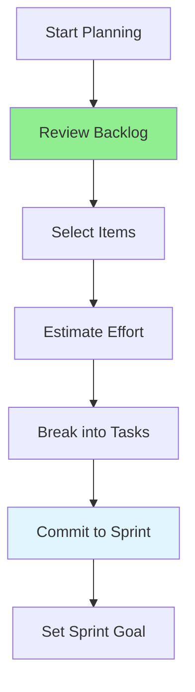

# 11.03 Sprint Planning / Lập kế hoạch Sprint

## Table of Contents / Mục lục
1. [Introduction / Giới thiệu](#introduction--giới-thiệu)
2. [Planning Process / Quy trình lập kế hoạch](#planning-process--quy-trình-lập-kế-hoạch)
3. [Best Practices / Thực hành tốt nhất](#best-practices--thực-hành-tốt-nhất)
4. [Summary / Tóm tắt](#summary--tóm-tắt)

---

## Introduction / Giới thiệu

### Overview / Tổng quan

**English**: Sprint planning sets the stage for the sprint. Learn to select backlog items, break them into tasks, and create a realistic sprint plan.

**Vietnamese**: Lập kế hoạch Sprint đặt nền tảng cho sprint. Học cách chọn backlog items, phân nhỏ thành tasks và tạo kế hoạch sprint thực tế.

### Sprint Planning Flow / Luồng lập kế hoạch Sprint



---

## Planning Process / Quy trình lập kế hoạch

### Example 1: Sprint Planning / Ví dụ 1: Lập kế hoạch Sprint

```typescript
// Sprint planning process / Quy trình lập kế hoạch Sprint
interface SprintPlan {
  sprintNumber: number;
  goal: string;
  duration: number; // weeks / tuần
  items: BacklogItem[];
  capacity: number; // story points / điểm story
  committed: number; // story points / điểm story
}

// Plan sprint / Lập kế hoạch sprint
function planSprint(
  backlog: BacklogItem[],
  teamCapacity: number
): SprintPlan {
  const selected: BacklogItem[] = [];
  let totalPoints = 0;
  
  // Select items until capacity reached / Chọn items cho đến khi đạt capacity
  for (const item of backlog) {
    if (totalPoints + item.storyPoints <= teamCapacity) {
      selected.push(item);
      totalPoints += item.storyPoints;
    } else {
      break;
    }
  }
  
  return {
    sprintNumber: getNextSprintNumber(),
    goal: defineSprintGoal(selected),
    duration: 2, // 2 weeks / 2 tuần
    items: selected,
    capacity: teamCapacity,
    committed: totalPoints
  };
}
```

---

## Best Practices / Thực hành tốt nhất

1. **Prepare backlog** - Groom backlog before planning
2. **Set capacity** - Know team's available time
3. **Break down** - Split large items into tasks
4. **Set goal** - Define clear sprint goal
5. **Be realistic** - Don't overcommit

---

## Summary / Tóm tắt

### Key Takeaways / Điểm chính

- **Process**: Review, select, estimate, commit
- **Capacity**: Consider team availability
- **Goal**: Set clear sprint objective
- **Realism**: Commit to achievable work

### Next Steps / Bước tiếp theo

- [11.04 Daily Standup](./11.04_Daily_Standup.md) - Next: Daily Standup

---

**Last Updated / Cập nhật lần cuối**: 2024


