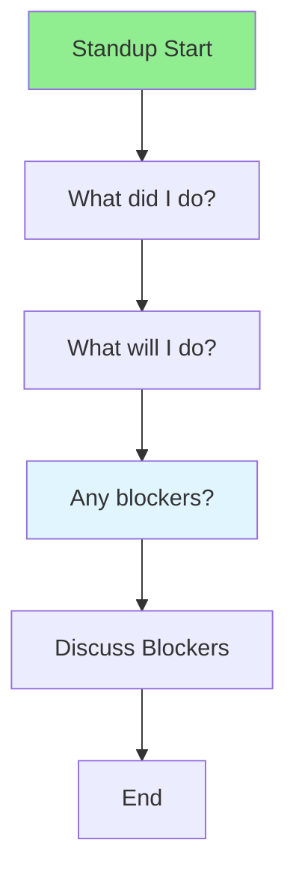

# 11.04 Daily Standup / Họp hàng ngày

## Table of Contents / Mục lục
1. [Introduction / Giới thiệu](#introduction--giới-thiệu)
2. [Standup Format / Định dạng standup](#standup-format--định-dạng-standup)
3. [Best Practices / Thực hành tốt nhất](#best-practices--thực-hành-tốt-nhất)
4. [Summary / Tóm tắt](#summary--tóm-tắt)

---

## Introduction / Giới thiệu

### Overview / Tổng quan

**English**: Daily standup keeps the team synchronized. Learn to conduct effective standups, share progress, and identify blockers.

**Vietnamese**: Họp hàng ngày giữ nhóm đồng bộ. Học cách tiến hành standup hiệu quả, chia sẻ tiến độ và xác định blockers.

### Daily Standup Flow / Luồng standup hàng ngày



---

## Standup Format / Định dạng standup

### Example 1: Daily Standup Structure / Ví dụ 1: Cấu trúc standup hàng ngày

```typescript
// Daily standup structure / Cấu trúc standup hàng ngày
interface StandupUpdate {
  developer: string;
  yesterday: string[];
  today: string[];
  blockers: string[];
}

// Standup format / Định dạng standup
function createStandupUpdate(
  developer: string,
  completed: string[],
  planned: string[],
  blockers: string[]
): StandupUpdate {
  return {
    developer,
    yesterday: completed,
    today: planned,
    blockers
  };
}

// Example standup / Ví dụ standup
const standup = createStandupUpdate(
  'Alice',
  ['Completed user authentication', 'Fixed login bug'],
  ['Implement password reset', 'Write tests'],
  ['Waiting for API design approval']
);
```

---

## Best Practices / Thực hành tốt nhất

1. **Keep it short** - 15 minutes maximum
2. **Stay focused** - Answer three questions
3. **Identify blockers** - Surface issues early
4. **Take notes** - Document blockers
5. **Follow up** - Address blockers after standup

---

## Summary / Tóm tắt

### Key Takeaways / Điểm chính

- **Format**: Three questions
- **Duration**: 15 minutes max
- **Focus**: Progress and blockers
- **Action**: Follow up on blockers

### Next Steps / Bước tiếp theo

- [11.05 Sprint Review](./11.05_Sprint_Review.md) - Next: Sprint Review

---

**Last Updated / Cập nhật lần cuối**: 2024


