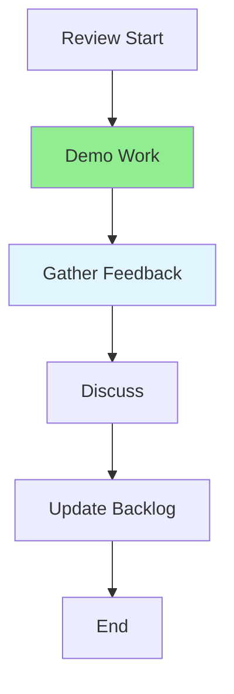

# 11.05 Sprint Review / Review Sprint

## Table of Contents / Mục lục
1. [Introduction / Giới thiệu](#introduction--giới-thiệu)
2. [Review Process / Quy trình review](#review-process--quy-trình-review)
3. [Best Practices / Thực hành tốt nhất](#best-practices--thực-hành-tốt-nhất)
4. [Summary / Tóm tắt](#summary--tóm-tắt)

---

## Introduction / Giới thiệu

### Overview / Tổng quan

**English**: Sprint review demonstrates completed work and gathers feedback. Learn to present work effectively and incorporate stakeholder feedback.

**Vietnamese**: Sprint review trình bày công việc đã hoàn thành và thu thập phản hồi. Học cách trình bày hiệu quả và tích hợp phản hồi từ stakeholders.

### Sprint Review Flow / Luồng review Sprint



---

## Review Process / Quy trình review

### Example 1: Sprint Review Structure / Ví dụ 1: Cấu trúc review Sprint

```typescript
// Sprint review structure / Cấu trúc review Sprint
interface SprintReview {
  sprint: Sprint;
  completed: Feature[];
  demo: DemoItem[];
  feedback: Feedback[];
  backlogUpdates: BacklogItem[];
}

// Conduct sprint review / Tiến hành review Sprint
function conductSprintReview(sprint: Sprint): SprintReview {
  return {
    sprint,
    completed: sprint.items.filter(item => item.status === 'done'),
    demo: prepareDemo(sprint),
    feedback: [],
    backlogUpdates: []
  };
}
```

---

## Best Practices / Thực hành tốt nhất

1. **Demo working software** - Show actual functionality
2. **Invite stakeholders** - Include product owner and users
3. **Gather feedback** - Listen to suggestions
4. **Update backlog** - Incorporate feedback
5. **Celebrate success** - Acknowledge achievements

---

## Summary / Tóm tắt

### Key Takeaways / Điểm chính

- **Demo**: Show working features
- **Feedback**: Gather stakeholder input
- **Updates**: Adjust backlog based on feedback
- **Celebration**: Recognize team achievements

### Next Steps / Bước tiếp theo

- [11.06 Sprint Retrospective](./11.06_Sprint_Retrospective.md) - Next: Sprint Retrospective

---

**Last Updated / Cập nhật lần cuối**: 2024


