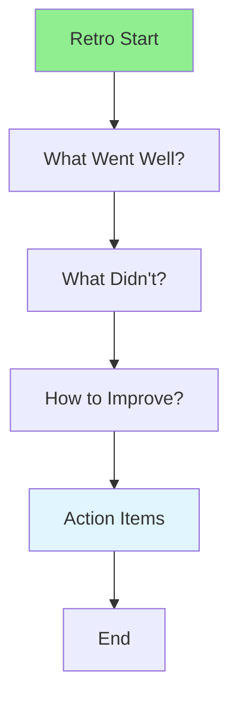

# 11.06 Sprint Retrospective / Tổng kết Sprint

## Table of Contents / Mục lục
1. [Introduction / Giới thiệu](#introduction--giới-thiệu)
2. [Retrospective Format / Định dạng tổng kết](#retrospective-format--định-dạng-tổng-kết)
3. [Best Practices / Thực hành tốt nhất](#best-practices--thực-hành-tốt-nhất)
4. [Summary / Tóm tắt](#summary--tóm-tắt)

---

## Introduction / Giới thiệu

### Overview / Tổng quan

**English**: Sprint retrospective helps teams improve. Learn to reflect on what went well, what didn't, and create action items for improvement.

**Vietnamese**: Tổng kết Sprint giúp nhóm cải thiện. Học cách phản ánh điều gì tốt, điều gì không và tạo action items để cải thiện.

### Retrospective Flow / Luồng tổng kết



---

## Retrospective Format / Định dạng tổng kết

### Example 1: Retrospective Structure / Ví dụ 1: Cấu trúc tổng kết

```typescript
// Retrospective structure / Cấu trúc tổng kết
interface Retrospective {
  sprint: Sprint;
  whatWentWell: string[];
  whatDidnt: string[];
  improvements: string[];
  actionItems: ActionItem[];
}

interface ActionItem {
  description: string;
  owner: string;
  dueDate: Date;
}

// Conduct retrospective / Tiến hành tổng kết
function conductRetrospective(sprint: Sprint): Retrospective {
  return {
    sprint,
    whatWentWell: [],
    whatDidnt: [],
    improvements: [],
    actionItems: []
  };
}
```

---

## Best Practices / Thực hành tốt nhất

1. **Create safe space** - Encourage honest feedback
2. **Focus on process** - Not individuals
3. **Generate actions** - Create specific improvements
4. **Follow up** - Track action items
5. **Celebrate wins** - Acknowledge successes

---

## Summary / Tóm tắt

### Key Takeaways / Điểm chính

- **Reflection**: What went well and what didn't
- **Improvement**: Identify areas to improve
- **Actions**: Create specific action items
- **Follow-up**: Track and implement improvements

### Next Steps / Bước tiếp theo

- [11.07 User Stories](./11.07_User_Stories.md) - Next: User Stories

---

**Last Updated / Cập nhật lần cuối**: 2024


