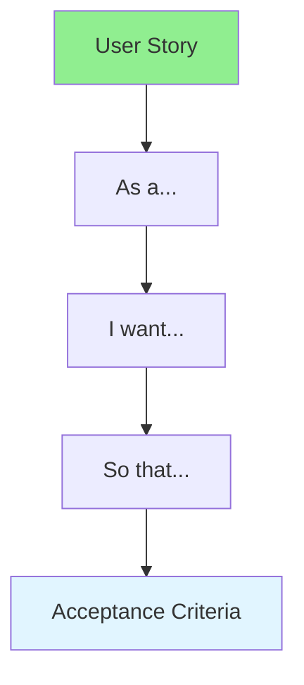

# 11.07 User Stories / Câu chuyện người dùng

## Table of Contents / Mục lục
1. [Introduction / Giới thiệu](#introduction--giới-thiệu)
2. [Story Format / Định dạng story](#story-format--định-dạng-story)
3. [Best Practices / Thực hành tốt nhất](#best-practices--thực-hành-tốt-nhất)
4. [Summary / Tóm tắt](#summary--tóm-tắt)

---

## Introduction / Giới thiệu

### Overview / Tổng quan

**English**: User stories describe features from the user's perspective. Learn to write clear, testable user stories with acceptance criteria.

**Vietnamese**: User stories mô tả tính năng từ góc nhìn người dùng. Học cách viết user stories rõ ràng, có thể kiểm thử với acceptance criteria.

### User Story Structure / Cấu trúc User Story



---

## Story Format / Định dạng story

### Example 1: User Story Template / Ví dụ 1: Mẫu User Story

```typescript
// User story structure / Cấu trúc user story
interface UserStory {
  id: string;
  title: string;
  as: string; // User type / Loại người dùng
  want: string; // What they want / Điều họ muốn
  soThat: string; // Why / Tại sao
  acceptanceCriteria: string[];
  storyPoints: number;
  priority: 'low' | 'medium' | 'high' | 'critical';
}

// Create user story / Tạo user story
function createUserStory(
  as: string,
  want: string,
  soThat: string,
  criteria: string[]
): UserStory {
  return {
    id: generateId(),
    title: `As ${as}, I want ${want}`,
    as,
    want,
    soThat,
    acceptanceCriteria: criteria,
    storyPoints: 0,
    priority: 'medium'
  };
}

// Example / Ví dụ
const story = createUserStory(
  'a user',
  'to reset my password',
  'I can regain access to my account',
  [
    'User can request password reset',
    'User receives reset email',
    'User can set new password',
    'User can login with new password'
  ]
);
```

---

## Best Practices / Thực hành tốt nhất

1. **User-focused** - Write from user perspective
2. **Clear value** - Explain the benefit
3. **Testable** - Include acceptance criteria
4. **Small enough** - Can complete in sprint
5. **Independent** - Standalone functionality

---

## Summary / Tóm tắt

### Key Takeaways / Điểm chính

- **Format**: As a... I want... So that...
- **Criteria**: Clear acceptance criteria
- **Value**: User-focused value
- **Size**: Appropriate story size

### Next Steps / Bước tiếp theo

- [11.08 Story Points](./11.08_Story_Points.md) - Next: Story Points

---

**Last Updated / Cập nhật lần cuối**: 2024


