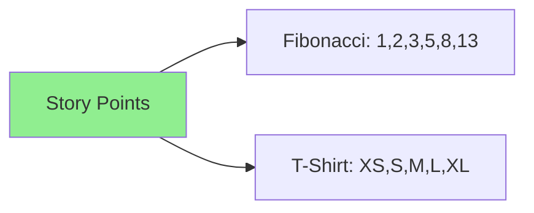

# 11.08 Story Points / Điểm Story

## Table of Contents / Mục lục
1. [Introduction / Giới thiệu](#introduction--giới-thiệu)
2. [Estimation / Ước tính](#estimation--ước-tính)
3. [Best Practices / Thực hành tốt nhất](#best-practices--thực-hành-tốt-nhất)
4. [Summary / Tóm tắt](#summary--tóm-tắt)

---

## Introduction / Giới thiệu

### Overview / Tổng quan

**English**: Story points estimate relative effort. Learn to use story points for estimation and velocity tracking.

**Vietnamese**: Story points ước tính effort tương đối. Học cách sử dụng story points để ước tính và theo dõi velocity.

### Story Points Scale / Thang điểm Story



---

## Estimation / Ước tính

### Example 1: Story Point Estimation / Ví dụ 1: Ước tính Story Points

```typescript
// Story point estimation / Ước tính story points
enum StoryPoint {
  ONE = 1,
  TWO = 2,
  THREE = 3,
  FIVE = 5,
  EIGHT = 8,
  THIRTEEN = 13
}

// Estimate story points / Ước tính story points
function estimateStoryPoints(
  complexity: 'low' | 'medium' | 'high' | 'very_high',
  effort: 'small' | 'medium' | 'large' | 'very_large'
): StoryPoint {
  if (complexity === 'low' && effort === 'small') return StoryPoint.ONE;
  if (complexity === 'low' && effort === 'medium') return StoryPoint.TWO;
  if (complexity === 'medium' && effort === 'medium') return StoryPoint.THREE;
  if (complexity === 'medium' && effort === 'large') return StoryPoint.FIVE;
  if (complexity === 'high' && effort === 'large') return StoryPoint.EIGHT;
  return StoryPoint.THIRTEEN;
}
```

---

## Best Practices / Thực hành tốt nhất

1. **Relative sizing** - Compare to reference story
2. **Team consensus** - Use planning poker
3. **Don't convert** - Points ≠ hours
4. **Re-estimate** - Update if understanding changes
5. **Track velocity** - Measure team capacity

---

## Summary / Tóm tắt

### Key Takeaways / Điểm chính

- **Scale**: Fibonacci or T-shirt sizing
- **Relative**: Compare to reference
- **Consensus**: Team agreement
- **Velocity**: Track team capacity

### Next Steps / Bước tiếp theo

- [11.09 Product Backlog](./11.09_Product_Backlog.md) - Next: Product Backlog

---

**Last Updated / Cập nhật lần cuối**: 2024


