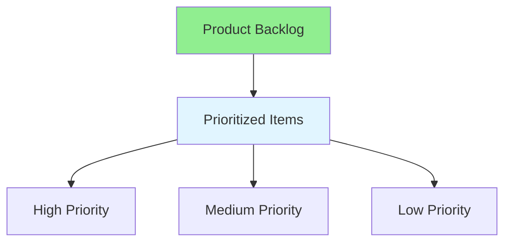

# 11.09 Product Backlog / Product Backlog

## Table of Contents / Mục lục
1. [Introduction / Giới thiệu](#introduction--giới-thiệu)
2. [Backlog Management / Quản lý backlog](#backlog-management--quản-lý-backlog)
3. [Best Practices / Thực hành tốt nhất](#best-practices--thực-hành-tốt-nhất)
4. [Summary / Tóm tắt](#summary--tóm-tắt)

---

## Introduction / Giới thiệu

### Overview / Tổng quan

**English**: Product backlog is the prioritized list of work. Learn to maintain, prioritize, and groom the product backlog.

**Vietnamese**: Product backlog là danh sách công việc được ưu tiên. Học cách duy trì, ưu tiên và groom product backlog.

### Product Backlog Structure / Cấu trúc Product Backlog



---

## Backlog Management / Quản lý backlog

### Example 1: Product Backlog / Ví dụ 1: Product Backlog

```typescript
// Product backlog / Product backlog
interface ProductBacklog {
  items: BacklogItem[];
  priority: 'high' | 'medium' | 'low';
}

// Prioritize backlog / Ưu tiên backlog
function prioritizeBacklog(items: BacklogItem[]): BacklogItem[] {
  return items.sort((a, b) => {
    if (a.priority !== b.priority) {
      const priorityOrder = { critical: 4, high: 3, medium: 2, low: 1 };
      return priorityOrder[b.priority] - priorityOrder[a.priority];
    }
    return b.value - a.value; // Higher value first / Giá trị cao hơn trước
  });
}
```

---

## Best Practices / Thực hành tốt nhất

1. **Keep prioritized** - Order by value and priority
2. **Groom regularly** - Refine items weekly
3. **Keep detailed** - Top items should be ready
4. **Review often** - Update based on feedback
5. **Visible** - Make backlog accessible

---

## Summary / Tóm tắt

### Key Takeaways / Điểm chính

- **Prioritization**: Order by value
- **Grooming**: Regular refinement
- **Detail**: Top items ready
- **Visibility**: Accessible to all

### Next Steps / Bước tiếp theo

- [11.10 Sprint Backlog](./11.10_Sprint_Backlog.md) - Next: Sprint Backlog

---

**Last Updated / Cập nhật lần cuối**: 2024

