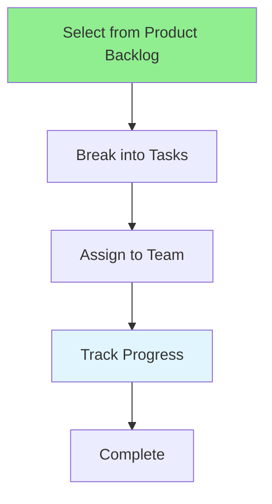

# 11.10 Sprint Backlog / Sprint Backlog

## Table of Contents / Mục lục
1. [Introduction / Giới thiệu](#introduction--giới-thiệu)
2. [Sprint Backlog Management / Quản lý Sprint Backlog](#sprint-backlog-management--quản-lý-sprint-backlog)
3. [Best Practices / Thực hành tốt nhất](#best-practices--thực-hành-tốt-nhất)
4. [Summary / Tóm tắt](#summary--tóm-tắt)

---

## Introduction / Giới thiệu

### Overview / Tổng quan

**English**: Sprint backlog contains work selected for the sprint. Learn to manage sprint backlog and track progress.

**Vietnamese**: Sprint backlog chứa công việc được chọn cho sprint. Học cách quản lý sprint backlog và theo dõi tiến độ.

### Sprint Backlog Flow / Luồng Sprint Backlog



---

## Sprint Backlog Management / Quản lý Sprint Backlog

### Example 1: Sprint Backlog / Ví dụ 1: Sprint Backlog

```typescript
// Sprint backlog / Sprint backlog
interface SprintBacklog {
  sprint: Sprint;
  items: BacklogItem[];
  tasks: Task[];
  capacity: number;
  committed: number;
}

// Create sprint backlog / Tạo sprint backlog
function createSprintBacklog(
  sprint: Sprint,
  items: BacklogItem[]
): SprintBacklog {
  const tasks = items.flatMap(item => breakDownIntoTasks(item));
  const committed = items.reduce((sum, item) => sum + item.storyPoints, 0);
  
  return {
    sprint,
    items,
    tasks,
    capacity: sprint.teamCapacity,
    committed
  };
}
```

---

## Best Practices / Thực hành tốt nhất

1. **Break down** - Split stories into tasks
2. **Assign owners** - Clear task ownership
3. **Track daily** - Update in standup
4. **Stay focused** - Avoid scope creep
5. **Complete fully** - Done means done

---

## Summary / Tóm tắt

### Key Takeaways / Điểm chính

- **Selection**: From product backlog
- **Breakdown**: Into tasks
- **Tracking**: Daily updates
- **Focus**: Stay on sprint goal

### Next Steps / Bước tiếp theo

- [11.11 Burndown Charts](./11.11_Burndown_Charts.md) - Next: Burndown Charts

---

**Last Updated / Cập nhật lần cuối**: 2024

