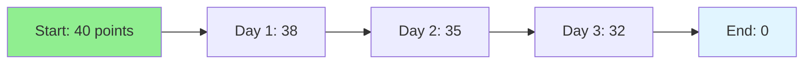

# 11.11 Burndown Charts / Biểu đồ Burndown

## Table of Contents / Mục lục
1. [Introduction / Giới thiệu](#introduction--giới-thiệu)
2. [Burndown Tracking / Theo dõi Burndown](#burndown-tracking--theo-dõi-burndown)
3. [Best Practices / Thực hành tốt nhất](#best-practices--thực-hành-tốt-nhất)
4. [Summary / Tóm tắt](#summary--tóm-tắt)

---

## Introduction / Giới thiệu

### Overview / Tổng quan

**English**: Burndown charts visualize sprint progress. Learn to read and interpret burndown charts to track sprint health.

**Vietnamese**: Biểu đồ Burndown trực quan hóa tiến độ sprint. Học cách đọc và giải thích burndown charts để theo dõi tình trạng sprint.

### Burndown Chart / Biểu đồ Burndown



---

## Burndown Tracking / Theo dõi Burndown

### Example 1: Burndown Calculation / Ví dụ 1: Tính toán Burndown

```typescript
// Burndown chart data / Dữ liệu biểu đồ burndown
interface BurndownData {
  day: number;
  remaining: number; // story points / điểm story
  ideal: number; // ideal remaining / còn lại lý tưởng
}

// Calculate burndown / Tính toán burndown
function calculateBurndown(
  totalPoints: number,
  days: number,
  completed: number[]
): BurndownData[] {
  const data: BurndownData[] = [];
  const idealRate = totalPoints / days;
  
  let remaining = totalPoints;
  for (let day = 1; day <= days; day++) {
    if (day <= completed.length) {
      remaining -= completed[day - 1];
    }
    data.push({
      day,
      remaining,
      ideal: totalPoints - (idealRate * day)
    });
  }
  
  return data;
}
```

---

## Best Practices / Thực hành tốt nhất

1. **Update daily** - Track progress daily
2. **Compare to ideal** - See if on track
3. **Identify issues** - Spot problems early
4. **Adjust if needed** - Replan if behind
5. **Use for planning** - Inform future sprints

---

## Summary / Tóm tắt

### Key Takeaways / Điểm chính

- **Visualization**: Track progress visually
- **Ideal line**: Compare to expected
- **Daily updates**: Keep current
- **Insights**: Identify trends

### Next Steps / Bước tiếp theo

- [11.12 Velocity](./11.12_Velocity.md) - Next: Velocity

---

**Last Updated / Cập nhật lần cuối**: 2024

