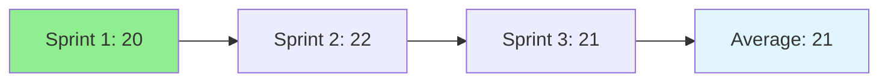

# 11.12 Velocity / Vận tốc

## Table of Contents / Mục lục
1. [Introduction / Giới thiệu](#introduction--giới-thiệu)
2. [Velocity Calculation / Tính toán Velocity](#velocity-calculation--tính-toán-velocity)
3. [Best Practices / Thực hành tốt nhất](#best-practices--thực-hành-tốt-nhất)
4. [Summary / Tóm tắt](#summary--tóm-tắt)

---

## Introduction / Giới thiệu

### Overview / Tổng quan

**English**: Velocity measures team capacity. Learn to calculate and use velocity for sprint planning and capacity estimation.

**Vietnamese**: Velocity đo lường năng lực nhóm. Học cách tính toán và sử dụng velocity cho lập kế hoạch sprint và ước tính năng lực.

### Velocity Tracking / Theo dõi Velocity



---

## Velocity Calculation / Tính toán Velocity

### Example 1: Velocity Calculation / Ví dụ 1: Tính toán Velocity

```typescript
// Velocity calculation / Tính toán velocity
interface Velocity {
  sprint: number;
  completed: number; // story points / điểm story
  average: number; // average over sprints / trung bình qua các sprint
}

// Calculate velocity / Tính toán velocity
function calculateVelocity(sprints: Sprint[]): Velocity[] {
  const velocities: Velocity[] = [];
  let total = 0;
  
  sprints.forEach((sprint, index) => {
    const completed = sprint.items
      .filter(item => item.status === 'done')
      .reduce((sum, item) => sum + item.storyPoints, 0);
    
    total += completed;
    velocities.push({
      sprint: sprint.number,
      completed,
      average: total / (index + 1)
    });
  });
  
  return velocities;
}
```

---

## Best Practices / Thực hành tốt nhất

1. **Track consistently** - Measure every sprint
2. **Use average** - Don't rely on single sprint
3. **Consider context** - Account for holidays, etc.
4. **Plan realistically** - Use velocity for planning
5. **Improve gradually** - Focus on consistency

---

## Summary / Tóm tắt

### Key Takeaways / Điểm chính

- **Measurement**: Story points completed per sprint
- **Average**: Use rolling average
- **Planning**: Guide sprint capacity
- **Consistency**: More important than high velocity

### Next Steps / Bước tiếp theo

- [11.13 Agile vs Waterfall](./11.13_Agile_vs_Waterfall.md) - Next: Agile vs Waterfall

---

**Last Updated / Cập nhật lần cuối**: 2024

