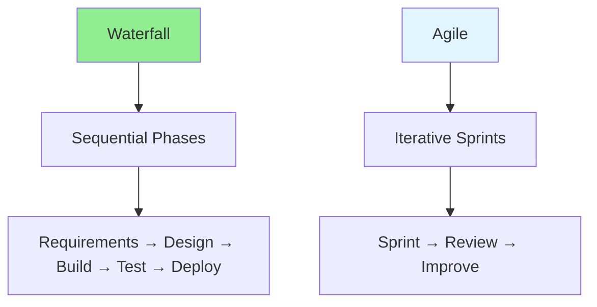

# 11.13 Agile vs Waterfall / Agile vs Waterfall

## Table of Contents / Mục lục
1. [Introduction / Giới thiệu](#introduction--giới-thiệu)
2. [Methodology Comparison / So sánh phương pháp](#methodology-comparison--so-sánh-phương-pháp)
3. [When to Use / Khi nào sử dụng](#when-to-use--khi-nào-sử-dụng)
4. [Best Practices / Thực hành tốt nhất](#best-practices--thực-hành-tốt-nhất)
5. [Summary / Tóm tắt](#summary--tóm-tắt)

---

## Introduction / Giới thiệu

### Overview / Tổng quan

**English**: Agile and Waterfall are different project management approaches. Understand their differences, strengths, and when to use each.

**Vietnamese**: Agile và Waterfall là các cách tiếp cận quản lý dự án khác nhau. Hiểu sự khác biệt, điểm mạnh và khi nào sử dụng mỗi phương pháp.

### Methodology Comparison / So sánh phương pháp



---

## Methodology Comparison / So sánh phương pháp

### Example 1: Comparison Table / Ví dụ 1: Bảng so sánh

```typescript
// Methodology comparison / So sánh phương pháp
interface MethodologyComparison {
  agile: {
    approach: 'Iterative and incremental';
    flexibility: 'High - welcomes change';
    delivery: 'Frequent small releases';
    feedback: 'Continuous';
    documentation: 'Minimal, just enough';
  };
  waterfall: {
    approach: 'Sequential phases';
    flexibility: 'Low - change is difficult';
    delivery: 'Single release at end';
    feedback: 'At end of project';
    documentation: 'Comprehensive upfront';
  };
}

// When to use / Khi nào sử dụng
const whenToUse = {
  agile: [
    'Requirements may change',
    'Need frequent feedback',
    'Complex projects',
    'Innovative products'
  ],
  waterfall: [
    'Requirements are fixed',
    'Regulated industries',
    'Simple, well-understood projects',
    'Contract-based projects'
  ]
};
```

---

## When to Use / Khi nào sử dụng

### Example 2: Decision Framework / Ví dụ 2: Khung quyết định

```typescript
// Choose methodology / Chọn phương pháp
function chooseMethodology(project: Project): 'agile' | 'waterfall' {
  if (project.requirementsFixed && project.regulatory) {
    return 'waterfall';
  }
  
  if (project.requirementsChanging || project.complex) {
    return 'agile';
  }
  
  return 'agile'; // Default to agile / Mặc định agile
}
```

---

## Best Practices / Thực hành tốt nhất

1. **Understand context** - Choose based on project needs
2. **Hybrid approach** - Combine when appropriate
3. **Team preference** - Consider team experience
4. **Client needs** - Align with stakeholder expectations
5. **Be flexible** - Adapt as needed

---

## Summary / Tóm tắt

### Key Takeaways / Điểm chính

- **Agile**: Iterative, flexible, frequent delivery
- **Waterfall**: Sequential, structured, comprehensive
- **Choice**: Depends on project characteristics
- **Hybrid**: Can combine approaches

### Next Steps / Bước tiếp theo

- [11.14 Scrum Roles](./11.14_Scrum_Roles.md) - Next: Scrum Roles

---

**Last Updated / Cập nhật lần cuối**: 2024

