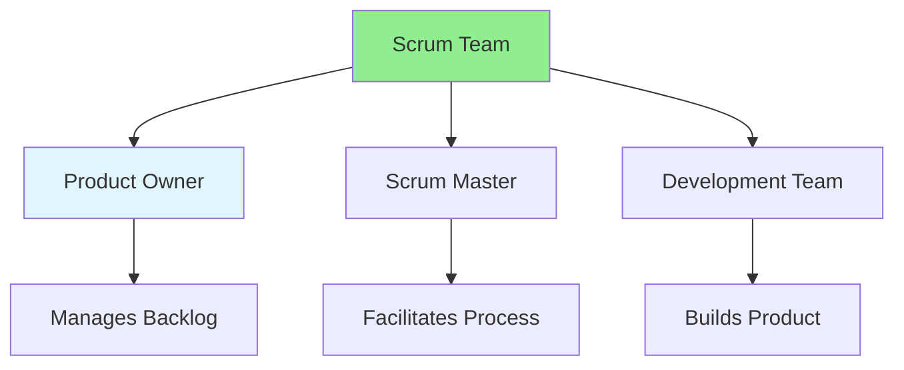

# 11.14 Scrum Roles / Vai trò Scrum

## Table of Contents / Mục lục
1. [Introduction / Giới thiệu](#introduction--giới-thiệu)
2. [Scrum Roles / Vai trò Scrum](#scrum-roles--vai-trò-scrum)
3. [Responsibilities / Trách nhiệm](#responsibilities--trách-nhiệm)
4. [Best Practices / Thực hành tốt nhất](#best-practices--thực-hành-tốt-nhất)
5. [Summary / Tóm tắt](#summary--tóm-tắt)

---

## Introduction / Giới thiệu

### Overview / Tổng quan

**English**: Scrum has three defined roles. Understand the responsibilities of Product Owner, Scrum Master, and Development Team.

**Vietnamese**: Scrum có ba vai trò được định nghĩa. Hiểu trách nhiệm của Product Owner, Scrum Master và Development Team.

### Scrum Roles / Vai trò Scrum



---

## Scrum Roles / Vai trò Scrum

### Example 1: Role Responsibilities / Ví dụ 1: Trách nhiệm vai trò

```typescript
// Scrum roles / Vai trò Scrum
interface ScrumRoles {
  productOwner: {
    responsibilities: [
      'Define product vision',
      'Prioritize backlog',
      'Accept/reject work',
      'Communicate with stakeholders'
    ];
    authority: 'Final say on requirements';
  };
  scrumMaster: {
    responsibilities: [
      'Facilitate Scrum events',
      'Remove impediments',
      'Coach team',
      'Protect team from interference'
    ];
    authority: 'Process authority';
  };
  developmentTeam: {
    responsibilities: [
      'Deliver working software',
      'Self-organize',
      'Estimate work',
      'Commit to sprint goal'
    ];
    authority: 'How to do the work';
  };
}
```

---

## Responsibilities / Trách nhiệm

### Example 2: Role Interactions / Ví dụ 2: Tương tác vai trò

```typescript
// Role interactions / Tương tác vai trò
class ScrumTeam {
  productOwner: ProductOwner;
  scrumMaster: ScrumMaster;
  developmentTeam: DevelopmentTeam[];
  
  // Product Owner defines what / Product Owner định nghĩa cái gì
  defineRequirements(): void {
    this.productOwner.prioritizeBacklog();
  }
  
  // Scrum Master facilitates how / Scrum Master tạo điều kiện như thế nào
  facilitateProcess(): void {
    this.scrumMaster.facilitateSprintPlanning();
    this.scrumMaster.removeBlockers();
  }
  
  // Development Team builds it / Development Team xây dựng nó
  buildProduct(): void {
    this.developmentTeam.forEach(dev => dev.deliverWork());
  }
}
```

---

## Best Practices / Thực hành tốt nhất

1. **Clear roles** - Understand responsibilities
2. **Respect boundaries** - Don't overstep roles
3. **Collaborate** - Work together effectively
4. **Support each other** - Help when needed
5. **Continuous improvement** - Reflect on role effectiveness

---

## Summary / Tóm tắt

### Key Takeaways / Điểm chính

- **Product Owner**: What to build
- **Scrum Master**: How to work
- **Development Team**: Build it
- **Collaboration**: Work together

### Next Steps / Bước tiếp theo

- Complete Group 11: Agile & Scrum ✅
- Move to [Group 12: Time Management](../Group-12-Time-Management/) - Coming next

---

**Last Updated / Cập nhật lần cuối**: 2024

