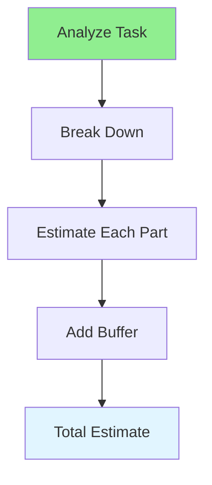

# 12.01 Time Estimation / Ước tính thời gian

## Table of Contents / Mục lục
1. [Introduction / Giới thiệu](#introduction--giới-thiệu)
2. [Estimation Techniques / Kỹ thuật ước tính](#estimation-techniques--kỹ-thuật-ước-tính)
3. [Best Practices / Thực hành tốt nhất](#best-practices--thực-hành-tốt-nhất)
4. [Summary / Tóm tắt](#summary--tóm-tắt)

---

## Introduction / Giới thiệu

### Overview / Tổng quan

**English**: Accurate time estimation is crucial for project planning. Learn techniques to estimate task duration more accurately.

**Vietnamese**: Ước tính thời gian chính xác rất quan trọng cho lập kế hoạch dự án. Học kỹ thuật để ước tính thời gian nhiệm vụ chính xác hơn.

### Time Estimation Flow / Luồng ước tính thời gian



---

## Estimation Techniques / Kỹ thuật ước tính

### Example 1: Time Estimation / Ví dụ 1: Ước tính thời gian

```typescript
// Time estimation / Ước tính thời gian
interface TimeEstimate {
  optimistic: number; // hours / giờ
  realistic: number; // hours / giờ
  pessimistic: number; // hours / giờ
  weighted: number; // (O + 4R + P) / 6
}

// Three-point estimation / Ước tính ba điểm
function estimateTime(
  optimistic: number,
  realistic: number,
  pessimistic: number
): TimeEstimate {
  return {
    optimistic,
    realistic,
    pessimistic,
    weighted: (optimistic + 4 * realistic + pessimistic) / 6
  };
}

// Example / Ví dụ
const estimate = estimateTime(2, 4, 8); // 2h optimistic, 4h realistic, 8h pessimistic
console.log(`Estimated time: ${estimate.weighted} hours`);
```

---

## Best Practices / Thực hành tốt nhất

1. **Break down tasks** - Estimate smaller pieces
2. **Use historical data** - Reference past similar tasks
3. **Add buffer** - Include time for unexpected issues
4. **Consider complexity** - Account for difficulty
5. **Review and adjust** - Learn from actual time

---

## Summary / Tóm tắt

### Key Takeaways / Điểm chính

- **Techniques**: Three-point, analogy, bottom-up
- **Breakdown**: Estimate smaller tasks
- **Buffer**: Add contingency time
- **Learning**: Improve from experience

### Next Steps / Bước tiếp theo

- [12.02 Task Planning](./12.02_Task_Planning.md) - Next: Task Planning

---

**Last Updated / Cập nhật lần cuối**: 2024

