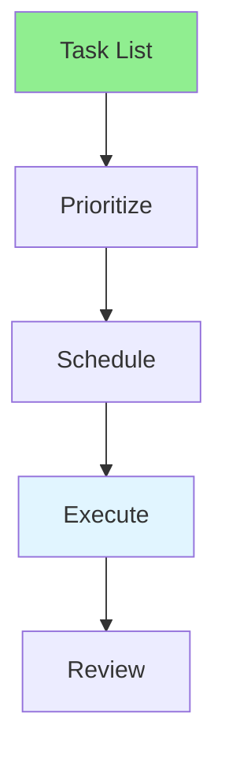

# 12.02 Task Planning / Lập kế hoạch nhiệm vụ

## Table of Contents / Mục lục
1. [Introduction / Giới thiệu](#introduction--giới-thiệu)
2. [Planning Process / Quy trình lập kế hoạch](#planning-process--quy-trình-lập-kế-hoạch)
3. [Best Practices / Thực hành tốt nhất](#best-practices--thực-hành-tốt-nhất)
4. [Summary / Tóm tắt](#summary--tóm-tắt)

---

## Introduction / Giới thiệu

### Overview / Tổng quan

**English**: Effective task planning improves productivity. Learn to organize tasks, set priorities, and create actionable plans.

**Vietnamese**: Lập kế hoạch nhiệm vụ hiệu quả cải thiện năng suất. Học cách tổ chức nhiệm vụ, đặt ưu tiên và tạo kế hoạch có thể thực hiện.

### Task Planning Flow / Luồng lập kế hoạch nhiệm vụ



---

## Planning Process / Quy trình lập kế hoạch

### Example 1: Task Planning / Ví dụ 1: Lập kế hoạch nhiệm vụ

```typescript
// Task planning / Lập kế hoạch nhiệm vụ
interface TaskPlan {
  tasks: Task[];
  priorities: Map<string, number>;
  schedule: Map<string, Date>;
}

// Plan tasks / Lập kế hoạch nhiệm vụ
function planTasks(tasks: Task[]): TaskPlan {
  const prioritized = tasks.sort((a, b) => 
    (b.priority || 0) - (a.priority || 0)
  );
  
  const schedule = new Map<string, Date>();
  let currentDate = new Date();
  
  prioritized.forEach(task => {
    schedule.set(task.id, currentDate);
    currentDate = addDays(currentDate, task.estimatedHours / 8);
  });
  
  return {
    tasks: prioritized,
    priorities: new Map(tasks.map(t => [t.id, t.priority || 0])),
    schedule
  };
}
```

---

## Best Practices / Thực hành tốt nhất

1. **List all tasks** - Don't miss anything
2. **Set priorities** - Focus on important work
3. **Estimate time** - Know how long tasks take
4. **Schedule realistically** - Don't overcommit
5. **Review regularly** - Adjust plan as needed

---

## Summary / Tóm tắt

### Key Takeaways / Điểm chính

- **Organization**: List and organize tasks
- **Prioritization**: Focus on important work
- **Scheduling**: Plan time realistically
- **Review**: Adjust plan regularly

### Next Steps / Bước tiếp theo

- [12.03 Priority Management](./12.03_Priority_Management.md) - Next: Priority Management

---

**Last Updated / Cập nhật lần cuối**: 2024

