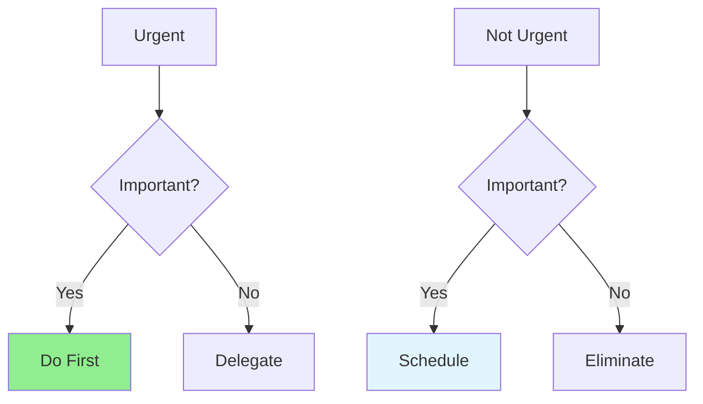

# 12.03 Priority Management / Quản lý ưu tiên

## Table of Contents / Mục lục
1. [Introduction / Giới thiệu](#introduction--giới-thiệu)
2. [Priority Framework / Khung ưu tiên](#priority-framework--khung-ưu-tiên)
3. [Best Practices / Thực hành tốt nhất](#best-practices--thực-hành-tốt-nhất)
4. [Summary / Tóm tắt](#summary--tóm-tắt)

---

## Introduction / Giới thiệu

### Overview / Tổng quan

**English**: Effective priority management helps focus on important work. Learn frameworks like Eisenhower Matrix and MoSCoW to prioritize tasks.

**Vietnamese**: Quản lý ưu tiên hiệu quả giúp tập trung vào công việc quan trọng. Học khung như Eisenhower Matrix và MoSCoW để ưu tiên nhiệm vụ.

### Priority Matrix / Ma trận ưu tiên



---

## Priority Framework / Khung ưu tiên

### Example 1: Priority Management / Ví dụ 1: Quản lý ưu tiên

```typescript
// Priority levels / Mức ưu tiên
enum Priority {
  CRITICAL = 'critical',
  HIGH = 'high',
  MEDIUM = 'medium',
  LOW = 'low'
}

// Eisenhower Matrix / Ma trận Eisenhower
interface TaskPriority {
  urgent: boolean;
  important: boolean;
  category: 'do' | 'schedule' | 'delegate' | 'eliminate';
}

function categorizeTask(task: TaskPriority): TaskPriority['category'] {
  if (task.urgent && task.important) return 'do';
  if (!task.urgent && task.important) return 'schedule';
  if (task.urgent && !task.important) return 'delegate';
  return 'eliminate';
}
```

---

## Best Practices / Thực hành tốt nhất

1. **Use frameworks** - Apply proven methods
2. **Review regularly** - Priorities change
3. **Focus on value** - Important over urgent
4. **Say no** - Decline low-priority work
5. **Delegate** - Assign appropriate tasks

---

## Summary / Tóm tắt

### Key Takeaways / Điểm chính

- **Frameworks**: Eisenhower, MoSCoW
- **Focus**: Important over urgent
- **Review**: Regular priority review
- **Action**: Do, schedule, delegate, eliminate

### Next Steps / Bước tiếp theo

- [12.04 Time Tracking](./12.04_Time_Tracking.md) - Next: Time Tracking

---

**Last Updated / Cập nhật lần cuối**: 2024

