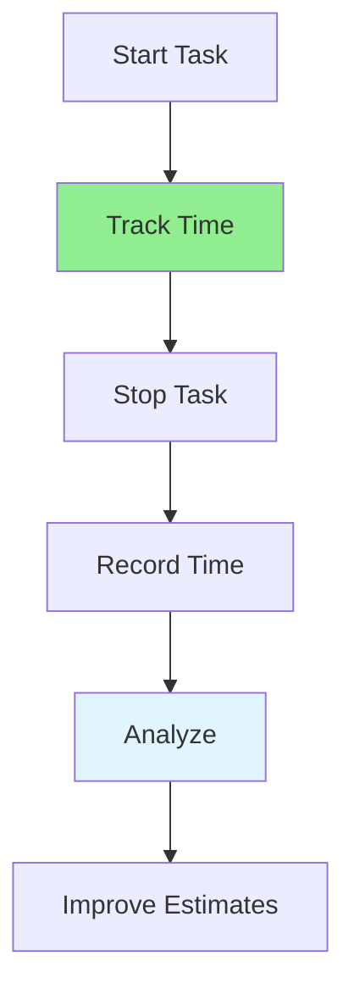

# 12.04 Time Tracking / Theo dõi thời gian

## Table of Contents / Mục lục
1. [Introduction / Giới thiệu](#introduction--giới-thiệu)
2. [Tracking Methods / Phương pháp theo dõi](#tracking-methods--phương-pháp-theo-dõi)
3. [Best Practices / Thực hành tốt nhất](#best-practices--thực-hành-tốt-nhất)
4. [Summary / Tóm tắt](#summary--tóm-tắt)

---

## Introduction / Giới thiệu

### Overview / Tổng quan

**English**: Time tracking helps understand where time is spent. Learn to track time accurately and use data to improve estimates and productivity.

**Vietnamese**: Theo dõi thời gian giúp hiểu thời gian được sử dụng ở đâu. Học cách theo dõi thời gian chính xác và sử dụng dữ liệu để cải thiện ước tính và năng suất.

### Time Tracking Flow / Luồng theo dõi thời gian



---

## Tracking Methods / Phương pháp theo dõi

### Example 1: Time Tracking / Ví dụ 1: Theo dõi thời gian

```typescript
// Time tracking / Theo dõi thời gian
interface TimeEntry {
  taskId: string;
  startTime: Date;
  endTime?: Date;
  duration?: number; // minutes / phút
  category: string;
}

class TimeTracker {
  private entries: TimeEntry[] = [];
  
  startTracking(taskId: string, category: string): void {
    this.entries.push({
      taskId,
      startTime: new Date(),
      category
    });
  }
  
  stopTracking(taskId: string): void {
    const entry = this.entries.find(e => e.taskId === taskId && !e.endTime);
    if (entry) {
      entry.endTime = new Date();
      entry.duration = (entry.endTime.getTime() - entry.startTime.getTime()) / 60000;
    }
  }
  
  getTotalTime(category: string): number {
    return this.entries
      .filter(e => e.category === category && e.duration)
      .reduce((sum, e) => sum + (e.duration || 0), 0);
  }
}
```

---

## Best Practices / Thực hành tốt nhất

1. **Track consistently** - Record all work time
2. **Use categories** - Organize by activity type
3. **Review regularly** - Analyze time patterns
4. **Improve estimates** - Use data for better estimates
5. **Identify waste** - Find time sinks

---

## Summary / Tóm tắt

### Key Takeaways / Điểm chính

- **Consistency**: Track all work time
- **Categories**: Organize by type
- **Analysis**: Review patterns
- **Improvement**: Use data to improve

### Next Steps / Bước tiếp theo

- [12.05 Deadline Management](./12.05_Deadline_Management.md) - Next: Deadline Management

---

**Last Updated / Cập nhật lần cuối**: 2024


