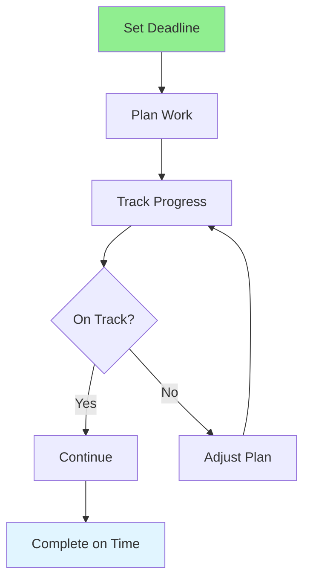

# 12.05 Deadline Management / Quản lý deadline

## Table of Contents / Mục lục
1. [Introduction / Giới thiệu](#introduction--giới-thiệu)
2. [Deadline Strategies / Chiến lược deadline](#deadline-strategies--chiến-lược-deadline)
3. [Best Practices / Thực hành tốt nhất](#best-practices--thực-hành-tốt-nhất)
4. [Summary / Tóm tắt](#summary--tóm-tắt)

---

## Introduction / Giới thiệu

### Overview / Tổng quan

**English**: Effective deadline management ensures timely delivery. Learn to set realistic deadlines, track progress, and handle deadline pressure.

**Vietnamese**: Quản lý deadline hiệu quả đảm bảo giao hàng đúng hạn. Học cách đặt deadline thực tế, theo dõi tiến độ và xử lý áp lực deadline.

### Deadline Management Flow / Luồng quản lý deadline



---

## Deadline Strategies / Chiến lược deadline

### Example 1: Deadline Management / Ví dụ 1: Quản lý deadline

```typescript
// Deadline management / Quản lý deadline
interface Deadline {
  taskId: string;
  dueDate: Date;
  buffer: number; // days / ngày
  actualDate?: Date;
  status: 'on_track' | 'at_risk' | 'overdue';
}

// Check deadline status / Kiểm tra trạng thái deadline
function checkDeadlineStatus(deadline: Deadline): Deadline['status'] {
  const now = new Date();
  const daysUntil = (deadline.dueDate.getTime() - now.getTime()) / (1000 * 60 * 60 * 24);
  const progress = getTaskProgress(deadline.taskId);
  
  if (daysUntil < 0) return 'overdue';
  if (daysUntil < deadline.buffer && progress < 0.8) return 'at_risk';
  return 'on_track';
}
```

---

## Best Practices / Thực hành tốt nhất

1. **Set realistic deadlines** - Account for buffer time
2. **Break down work** - Plan milestones
3. **Track progress** - Monitor regularly
4. **Communicate early** - Alert if at risk
5. **Adjust if needed** - Replan when necessary

---

## Summary / Tóm tắt

### Key Takeaways / Điểm chính

- **Realistic**: Set achievable deadlines
- **Tracking**: Monitor progress
- **Communication**: Alert early
- **Flexibility**: Adjust when needed

### Next Steps / Bước tiếp theo

- [12.06 Productivity Techniques](./12.06_Productivity_Techniques.md) - Next: Productivity Techniques

---

**Last Updated / Cập nhật lần cuối**: 2024

