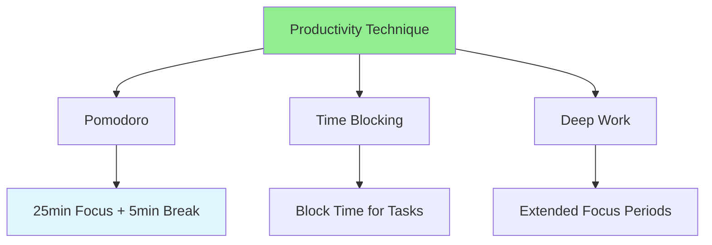

# 12.06 Productivity Techniques / Kỹ thuật năng suất

## Table of Contents / Mục lục
1. [Introduction / Giới thiệu](#introduction--giới-thiệu)
2. [Productivity Methods / Phương pháp năng suất](#productivity-methods--phương-pháp-năng-suất)
3. [Best Practices / Thực hành tốt nhất](#best-practices--thực-hành-tốt-nhất)
4. [Summary / Tóm tắt](#summary--tóm-tắt)

---

## Introduction / Giới thiệu

### Overview / Tổng quan

**English**: Productivity techniques help maximize output. Learn methods like Pomodoro, time blocking, and deep work to improve efficiency.

**Vietnamese**: Kỹ thuật năng suất giúp tối đa hóa đầu ra. Học phương pháp như Pomodoro, time blocking và deep work để cải thiện hiệu quả.

### Productivity Techniques / Kỹ thuật năng suất



---

## Productivity Methods / Phương pháp năng suất

### Example 1: Pomodoro Technique / Ví dụ 1: Kỹ thuật Pomodoro

```typescript
// Pomodoro technique / Kỹ thuật Pomodoro
class PomodoroTimer {
  private workDuration = 25; // minutes / phút
  private breakDuration = 5; // minutes / phút
  private longBreakDuration = 15; // minutes / phút
  private pomodoros = 0;
  
  startWork(): void {
    console.log(`Work for ${this.workDuration} minutes`);
    // Timer logic / Logic timer
    this.pomodoros++;
  }
  
  takeBreak(): void {
    const breakTime = this.pomodoros % 4 === 0 
      ? this.longBreakDuration 
      : this.breakDuration;
    console.log(`Break for ${breakTime} minutes`);
  }
}
```

---

## Best Practices / Thực hành tốt nhất

1. **Use Pomodoro** - 25-minute focused work
2. **Time blocking** - Schedule specific time slots
3. **Deep work** - Extended focus periods
4. **Eliminate distractions** - Focus on task
5. **Take breaks** - Rest and recharge

---

## Summary / Tóm tắt

### Key Takeaways / Điểm chính

- **Pomodoro**: 25-minute work sessions
- **Time blocking**: Schedule time slots
- **Deep work**: Extended focus
- **Breaks**: Regular rest periods

### Next Steps / Bước tiếp theo

- [12.07 Focus Management](./12.07_Focus_Management.md) - Next: Focus Management

---

**Last Updated / Cập nhật lần cuối**: 2024


