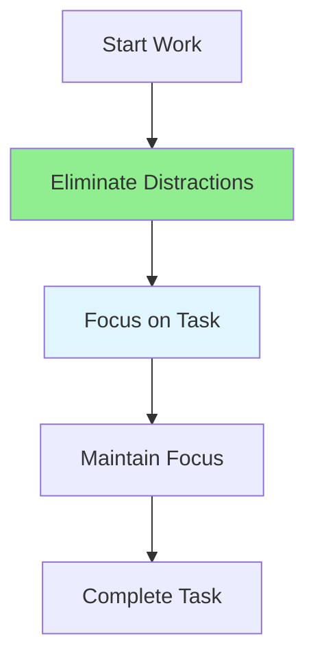

# 12.07 Focus Management / Quản lý tập trung

## Table of Contents / Mục lục
1. [Introduction / Giới thiệu](#introduction--giới-thiệu)
2. [Focus Techniques / Kỹ thuật tập trung](#focus-techniques--kỹ-thuật-tập-trung)
3. [Best Practices / Thực hành tốt nhất](#best-practices--thực-hành-tốt-nhất)
4. [Summary / Tóm tắt](#summary--tóm-tắt)

---

## Introduction / Giới thiệu

### Overview / Tổng quan

**English**: Maintaining focus improves productivity. Learn techniques to minimize distractions and maintain concentration on important work.

**Vietnamese**: Duy trì tập trung cải thiện năng suất. Học kỹ thuật để giảm thiểu phân tâm và duy trì tập trung vào công việc quan trọng.

### Focus Management / Quản lý tập trung



---

## Focus Techniques / Kỹ thuật tập trung

### Example 1: Focus Management / Ví dụ 1: Quản lý tập trung

```typescript
// Focus management / Quản lý tập trung
interface FocusSession {
  task: string;
  startTime: Date;
  distractions: number;
  duration: number; // minutes / phút
}

class FocusManager {
  private session: FocusSession | null = null;
  
  startFocusSession(task: string): void {
    this.session = {
      task,
      startTime: new Date(),
      distractions: 0,
      duration: 0
    };
    this.eliminateDistractions();
  }
  
  private eliminateDistractions(): void {
    // Close notifications / Đóng thông báo
    // Block distracting websites / Chặn website gây phân tâm
    // Set phone to silent / Đặt điện thoại im lặng
  }
  
  recordDistraction(): void {
    if (this.session) {
      this.session.distractions++;
    }
  }
}
```

---

## Best Practices / Thực hành tốt nhất

1. **Eliminate distractions** - Remove interruptions
2. **Single tasking** - Focus on one thing
3. **Time blocks** - Dedicated focus time
4. **Environment** - Create focus-friendly space
5. **Practice** - Build focus muscle

---

## Summary / Tóm tắt

### Key Takeaways / Điểm chính

- **Elimination**: Remove distractions
- **Single tasking**: One thing at a time
- **Environment**: Focus-friendly space
- **Practice**: Build focus skills

### Next Steps / Bước tiếp theo

- [12.08 Distraction Management](./12.08_Distraction_Management.md) - Next: Distraction Management

---

**Last Updated / Cập nhật lần cuối**: 2024

