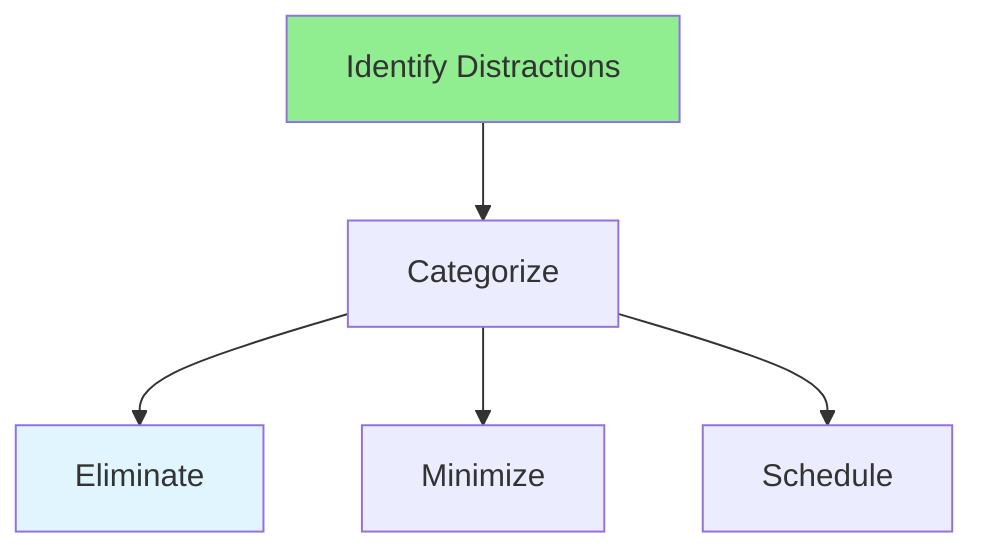

# 12.08 Distraction Management / Quản lý phân tâm

## Table of Contents / Mục lục
1. [Introduction / Giới thiệu](#introduction--giới-thiệu)
2. [Distraction Types / Loại phân tâm](#distraction-types--loại-phân-tâm)
3. [Management Strategies / Chiến lược quản lý](#management-strategies--chiến-lược-quản-lý)
4. [Best Practices / Thực hành tốt nhất](#best-practices--thực-hành-tốt-nhất)
5. [Summary / Tóm tắt](#summary--tóm-tắt)

---

## Introduction / Giới thiệu

### Overview / Tổng quan

**English**: Managing distractions is key to productivity. Learn to identify, minimize, and handle distractions effectively.

**Vietnamese**: Quản lý phân tâm là chìa khóa cho năng suất. Học cách xác định, giảm thiểu và xử lý phân tâm hiệu quả.

### Distraction Management / Quản lý phân tâm



---

## Distraction Types / Loại phân tâm

### Example 1: Distraction Management / Ví dụ 1: Quản lý phân tâm

```typescript
// Distraction types / Loại phân tâm
enum DistractionType {
  DIGITAL = 'digital', // Notifications, social media / Thông báo, mạng xã hội
  ENVIRONMENTAL = 'environmental', // Noise, interruptions / Tiếng ồn, gián đoạn
  INTERNAL = 'internal', // Thoughts, worries / Suy nghĩ, lo lắng
  SOCIAL = 'social' // Colleagues, meetings / Đồng nghiệp, cuộc họp
}

// Manage distractions / Quản lý phân tâm
function manageDistraction(type: DistractionType): string {
  switch (type) {
    case DistractionType.DIGITAL:
      return 'Turn off notifications, use website blockers';
    case DistractionType.ENVIRONMENTAL:
      return 'Use noise-cancelling headphones, find quiet space';
    case DistractionType.INTERNAL:
      return 'Write down thoughts, practice mindfulness';
    case DistractionType.SOCIAL:
      return 'Set boundaries, schedule communication time';
  }
}
```

---

## Best Practices / Thực hành tốt nhất

1. **Identify sources** - Know what distracts you
2. **Eliminate** - Remove unnecessary distractions
3. **Minimize** - Reduce unavoidable ones
4. **Schedule** - Plan distraction time
5. **Practice** - Build resistance

---

## Summary / Tóm tắt

### Key Takeaways / Điểm chính

- **Types**: Digital, environmental, internal, social
- **Elimination**: Remove when possible
- **Minimization**: Reduce impact
- **Scheduling**: Plan distraction time

### Next Steps / Bước tiếp theo

- [12.09 Work-Life Balance](./12.09_Work_Life_Balance.md) - Next: Work-Life Balance

---

**Last Updated / Cập nhật lần cuối**: 2024


