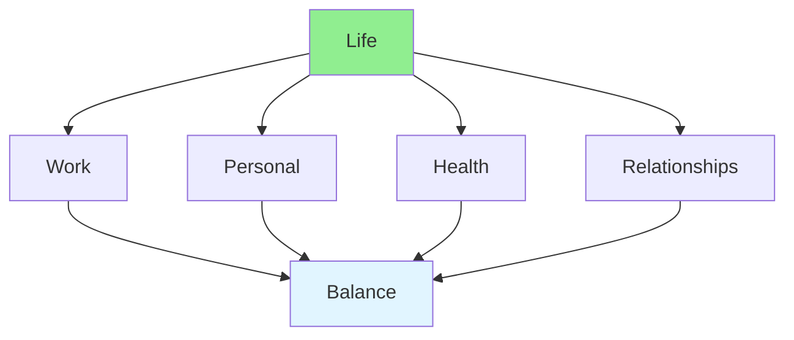

# 12.09 Work-Life Balance / Cân bằng công việc-cuộc sống

## Table of Contents / Mục lục
1. [Introduction / Giới thiệu](#introduction--giới-thiệu)
2. [Balance Strategies / Chiến lược cân bằng](#balance-strategies--chiến-lược-cân-bằng)
3. [Best Practices / Thực hành tốt nhất](#best-practices--thực-hành-tốt-nhất)
4. [Summary / Tóm tắt](#summary--tóm-tắt)

---

## Introduction / Giới thiệu

### Overview / Tổng quan

**English**: Work-life balance is essential for well-being and productivity. Learn to set boundaries, manage time, and maintain healthy habits.

**Vietnamese**: Cân bằng công việc-cuộc sống rất quan trọng cho sức khỏe và năng suất. Học cách đặt ranh giới, quản lý thời gian và duy trì thói quen lành mạnh.

### Work-Life Balance / Cân bằng công việc-cuộc sống



---

## Balance Strategies / Chiến lược cân bằng

### Example 1: Work-Life Balance / Ví dụ 1: Cân bằng công việc-cuộc sống

```typescript
// Work-life balance / Cân bằng công việc-cuộc sống
interface BalancePlan {
  workHours: number;
  personalTime: number;
  health: string[];
  relationships: string[];
  boundaries: string[];
}

// Create balance plan / Tạo kế hoạch cân bằng
function createBalancePlan(): BalancePlan {
  return {
    workHours: 8,
    personalTime: 4,
    health: ['Exercise 30min daily', 'Sleep 8 hours'],
    relationships: ['Family dinner', 'Friends weekly'],
    boundaries: ['No work after 6pm', 'No emails on weekends']
  };
}
```

---

## Best Practices / Thực hành tốt nhất

1. **Set boundaries** - Define work hours
2. **Take breaks** - Regular rest periods
3. **Prioritize health** - Exercise and sleep
4. **Nurture relationships** - Time for family/friends
5. **Unplug** - Disconnect from work

---

## Summary / Tóm tắt

### Key Takeaways / Điểm chính

- **Boundaries**: Set clear limits
- **Health**: Prioritize well-being
- **Relationships**: Maintain connections
- **Balance**: Work and life harmony

### Next Steps / Bước tiếp theo

- [12.10 Self-Assessment](./12.10_Self_Assessment.md) - Next: Self-Assessment

---

**Last Updated / Cập nhật lần cuối**: 2024


