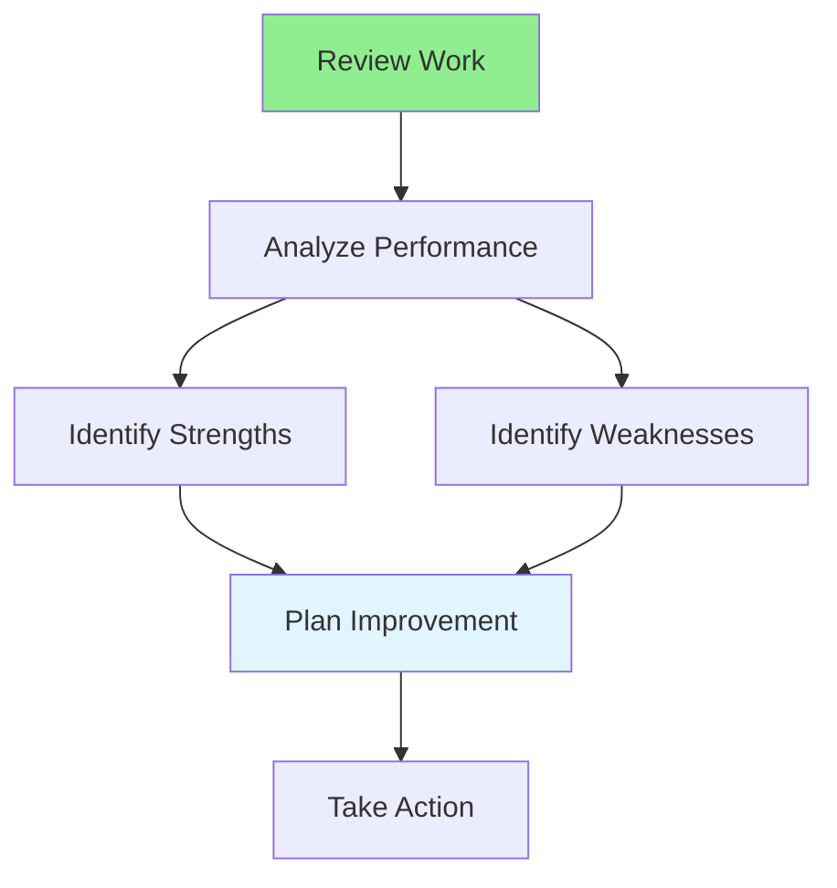

# 12.10 Self-Assessment / Tự đánh giá

## Table of Contents / Mục lục
1. [Introduction / Giới thiệu](#introduction--giới-thiệu)
2. [Assessment Methods / Phương pháp đánh giá](#assessment-methods--phương-pháp-đánh-giá)
3. [Best Practices / Thực hành tốt nhất](#best-practices--thực-hành-tốt-nhất)
4. [Summary / Tóm tắt](#summary--tóm-tắt)

---

## Introduction / Giới thiệu

### Overview / Tổng quan

**English**: Self-assessment helps identify strengths and areas for improvement. Learn to evaluate your work, skills, and progress objectively.

**Vietnamese**: Tự đánh giá giúp xác định điểm mạnh và lĩnh vực cần cải thiện. Học cách đánh giá công việc, kỹ năng và tiến độ một cách khách quan.

### Self-Assessment Flow / Luồng tự đánh giá



---

## Assessment Methods / Phương pháp đánh giá

### Example 1: Self-Assessment / Ví dụ 1: Tự đánh giá

```typescript
// Self-assessment / Tự đánh giá
interface SelfAssessment {
  period: string;
  strengths: string[];
  weaknesses: string[];
  achievements: string[];
  improvements: string[];
  goals: string[];
}

// Conduct self-assessment / Tiến hành tự đánh giá
function conductSelfAssessment(period: string): SelfAssessment {
  return {
    period,
    strengths: [],
    weaknesses: [],
    achievements: [],
    improvements: [],
    goals: []
  };
}
```

---

## Best Practices / Thực hành tốt nhất

1. **Be honest** - Objective self-evaluation
2. **Regular reviews** - Weekly or monthly
3. **Track metrics** - Use data
4. **Seek feedback** - Get others' perspectives
5. **Action plan** - Create improvement plan

---

## Summary / Tóm tắt

### Key Takeaways / Điểm chính

- **Honesty**: Objective evaluation
- **Regularity**: Frequent reviews
- **Metrics**: Data-driven
- **Feedback**: External perspectives
- **Action**: Improvement plan

### Next Steps / Bước tiếp theo

- [12.11 Goal Setting](./12.11_Goal_Setting.md) - Next: Goal Setting

---

**Last Updated / Cập nhật lần cuối**: 2024

