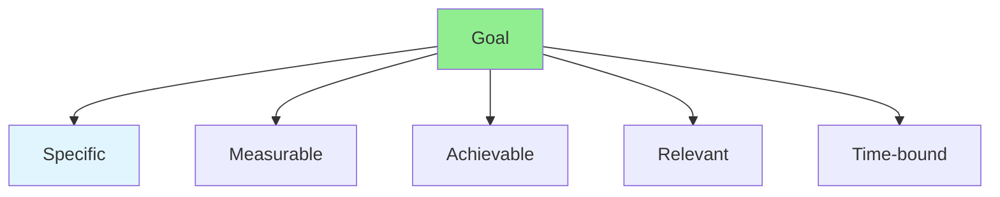

# 12.11 Goal Setting / Đặt mục tiêu

## Table of Contents / Mục lục
1. [Introduction / Giới thiệu](#introduction--giới-thiệu)
2. [SMART Goals / Mục tiêu SMART](#smart-goals--mục-tiêu-smart)
3. [Best Practices / Thực hành tốt nhất](#best-practices--thực-hành-tốt-nhất)
4. [Summary / Tóm tắt](#summary--tóm-tắt)

---

## Introduction / Giới thiệu

### Overview / Tổng quan

**English**: Effective goal setting provides direction and motivation. Learn to set SMART goals and track progress toward achievement.

**Vietnamese**: Đặt mục tiêu hiệu quả cung cấp hướng đi và động lực. Học cách đặt mục tiêu SMART và theo dõi tiến độ đạt được.

### Goal Setting Framework / Khung đặt mục tiêu



---

## SMART Goals / Mục tiêu SMART

### Example 1: SMART Goal / Ví dụ 1: Mục tiêu SMART

```typescript
// SMART goal / Mục tiêu SMART
interface SMARTGoal {
  specific: string; // What exactly? / Chính xác là gì?
  measurable: string; // How to measure? / Làm sao đo lường?
  achievable: string; // Is it realistic? / Có thực tế không?
  relevant: string; // Why important? / Tại sao quan trọng?
  timebound: Date; // When? / Khi nào?
}

// Create SMART goal / Tạo mục tiêu SMART
function createSMARTGoal(
  specific: string,
  measurable: string,
  achievable: string,
  relevant: string,
  deadline: Date
): SMARTGoal {
  return {
    specific,
    measurable,
    achievable,
    relevant,
    timebound: deadline
  };
}

// Example / Ví dụ
const goal = createSMARTGoal(
  'Learn TypeScript',
  'Complete 5 projects',
  '2 hours daily for 3 months',
  'Required for current project',
  new Date('2024-12-31')
);
```

---

## Best Practices / Thực hành tốt nhất

1. **Use SMART** - Specific, measurable, achievable, relevant, time-bound
2. **Write down** - Document goals
3. **Break down** - Split into smaller goals
4. **Track progress** - Monitor regularly
5. **Adjust** - Update as needed

---

## Summary / Tóm tắt

### Key Takeaways / Điểm chính

- **SMART**: Specific, measurable, achievable, relevant, time-bound
- **Documentation**: Write goals down
- **Breakdown**: Smaller milestones
- **Tracking**: Monitor progress

### Next Steps / Bước tiếp theo

- [12.12 Progress Tracking](./12.12_Progress_Tracking.md) - Next: Progress Tracking

---

**Last Updated / Cập nhật lần cuối**: 2024


