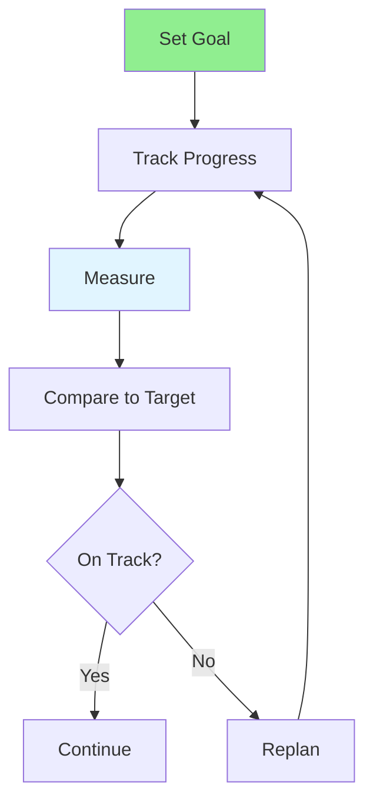

# 12.12 Progress Tracking / Theo dõi tiến độ

## Table of Contents / Mục lục
1. [Introduction / Giới thiệu](#introduction--giới-thiệu)
2. [Tracking Methods / Phương pháp theo dõi](#tracking-methods--phương-pháp-theo-dõi)
3. [Best Practices / Thực hành tốt nhất](#best-practices--thực-hành-tốt-nhất)
4. [Summary / Tóm tắt](#summary--tóm-tắt)

---

## Introduction / Giới thiệu

### Overview / Tổng quan

**English**: Tracking progress helps stay on course and identify issues early. Learn to monitor progress toward goals and adjust plans as needed.

**Vietnamese**: Theo dõi tiến độ giúp đi đúng hướng và xác định vấn đề sớm. Học cách theo dõi tiến độ hướng tới mục tiêu và điều chỉnh kế hoạch khi cần.

### Progress Tracking Flow / Luồng theo dõi tiến độ



---

## Tracking Methods / Phương pháp theo dõi

### Example 1: Progress Tracking / Ví dụ 1: Theo dõi tiến độ

```typescript
// Progress tracking / Theo dõi tiến độ
interface Progress {
  goalId: string;
  current: number;
  target: number;
  percentage: number;
  status: 'on_track' | 'behind' | 'ahead';
}

// Track progress / Theo dõi tiến độ
function trackProgress(
  goalId: string,
  current: number,
  target: number
): Progress {
  const percentage = (current / target) * 100;
  const expected = calculateExpectedProgress(goalId);
  
  let status: Progress['status'];
  if (percentage >= expected * 0.9) status = 'on_track';
  else if (percentage < expected * 0.8) status = 'behind';
  else status = 'ahead';
  
  return { goalId, current, target, percentage, status };
}
```

---

## Best Practices / Thực hành tốt nhất

1. **Track regularly** - Daily or weekly updates
2. **Use metrics** - Quantifiable measures
3. **Visualize** - Charts and graphs
4. **Review** - Analyze patterns
5. **Adjust** - Update plans based on data

---

## Summary / Tóm tắt

### Key Takeaways / Điểm chính

- **Regularity**: Track consistently
- **Metrics**: Use quantifiable measures
- **Visualization**: Charts and graphs
- **Review**: Analyze patterns
- **Adjustment**: Update plans

### Next Steps / Bước tiếp theo

- [12.13 Skill Development](./12.13_Skill_Development.md) - Next: Skill Development

---

**Last Updated / Cập nhật lần cuối**: 2024


