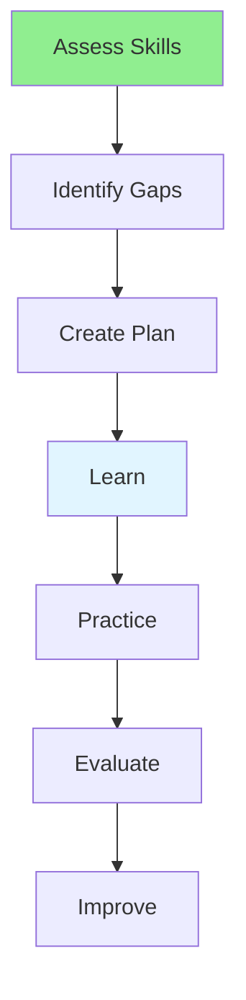

# 12.13 Skill Development / Phát triển kỹ năng

## Table of Contents / Mục lục
1. [Introduction / Giới thiệu](#introduction--giới-thiệu)
2. [Development Plan / Kế hoạch phát triển](#development-plan--kế-hoạch-phát-triển)
3. [Best Practices / Thực hành tốt nhất](#best-practices--thực-hành-tốt-nhất)
4. [Summary / Tóm tắt](#summary--tóm-tắt)

---

## Introduction / Giới thiệu

### Overview / Tổng quan

**English**: Continuous skill development is essential for career growth. Learn to identify skill gaps, create learning plans, and track development.

**Vietnamese**: Phát triển kỹ năng liên tục rất quan trọng cho phát triển sự nghiệp. Học cách xác định khoảng trống kỹ năng, tạo kế hoạch học tập và theo dõi phát triển.

### Skill Development Flow / Luồng phát triển kỹ năng



---

## Development Plan / Kế hoạch phát triển

### Example 1: Skill Development / Ví dụ 1: Phát triển kỹ năng

```typescript
// Skill development plan / Kế hoạch phát triển kỹ năng
interface SkillDevelopment {
  skill: string;
  currentLevel: number; // 1-5 / 1-5
  targetLevel: number; // 1-5 / 1-5
  learningResources: string[];
  practiceProjects: string[];
  timeline: Date;
}

// Create development plan / Tạo kế hoạch phát triển
function createDevelopmentPlan(
  skill: string,
  current: number,
  target: number
): SkillDevelopment {
  return {
    skill,
    currentLevel: current,
    targetLevel: target,
    learningResources: [],
    practiceProjects: [],
    timeline: new Date()
  };
}
```

---

## Best Practices / Thực hành tốt nhất

1. **Identify gaps** - Know what to learn
2. **Set goals** - Define target level
3. **Find resources** - Courses, books, tutorials
4. **Practice** - Build projects
5. **Track progress** - Monitor improvement

---

## Summary / Tóm tắt

### Key Takeaways / Điểm chính

- **Assessment**: Identify current level
- **Planning**: Create learning plan
- **Resources**: Find learning materials
- **Practice**: Apply skills
- **Tracking**: Monitor progress

### Next Steps / Bước tiếp theo

- [12.14 Learning Planning](./12.14_Learning_Planning.md) - Next: Learning Planning

---

**Last Updated / Cập nhật lần cuối**: 2024

