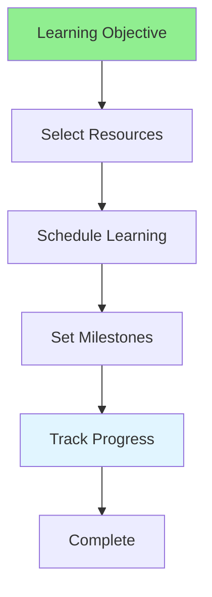

# 12.14 Learning Planning / Lập kế hoạch học tập

## Table of Contents / Mục lục
1. [Introduction / Giới thiệu](#introduction--giới-thiệu)
2. [Learning Plan / Kế hoạch học tập](#learning-plan--kế-hoạch-học-tập)
3. [Best Practices / Thực hành tốt nhất](#best-practices--thực-hành-tốt-nhất)
4. [Summary / Tóm tắt](#summary--tóm-tắt)

---

## Introduction / Giới thiệu

### Overview / Tổng quan

**English**: Structured learning plans improve learning outcomes. Learn to create effective learning plans with clear objectives and milestones.

**Vietnamese**: Kế hoạch học tập có cấu trúc cải thiện kết quả học tập. Học cách tạo kế hoạch học tập hiệu quả với mục tiêu và cột mốc rõ ràng.

### Learning Planning Flow / Luồng lập kế hoạch học tập



---

## Learning Plan / Kế hoạch học tập

### Example 1: Learning Plan / Ví dụ 1: Kế hoạch học tập

```typescript
// Learning plan / Kế hoạch học tập
interface LearningPlan {
  topic: string;
  objective: string;
  resources: LearningResource[];
  schedule: LearningSession[];
  milestones: Milestone[];
  duration: number; // weeks / tuần
}

interface LearningResource {
  type: 'course' | 'book' | 'tutorial' | 'practice';
  name: string;
  url?: string;
}

// Create learning plan / Tạo kế hoạch học tập
function createLearningPlan(
  topic: string,
  objective: string,
  duration: number
): LearningPlan {
  return {
    topic,
    objective,
    resources: [],
    schedule: [],
    milestones: [],
    duration
  };
}
```

---

## Best Practices / Thực hành tốt nhất

1. **Set objectives** - Clear learning goals
2. **Choose resources** - Quality materials
3. **Schedule time** - Regular learning sessions
4. **Set milestones** - Track progress
5. **Practice** - Apply what you learn

---

## Summary / Tóm tắt

### Key Takeaways / Điểm chính

- **Objectives**: Clear learning goals
- **Resources**: Quality materials
- **Schedule**: Regular sessions
- **Milestones**: Progress tracking
- **Practice**: Application

### Next Steps / Bước tiếp theo

- [12.15 Career Planning](./12.15_Career_Planning.md) - Next: Career Planning

---

**Last Updated / Cập nhật lần cuối**: 2024

