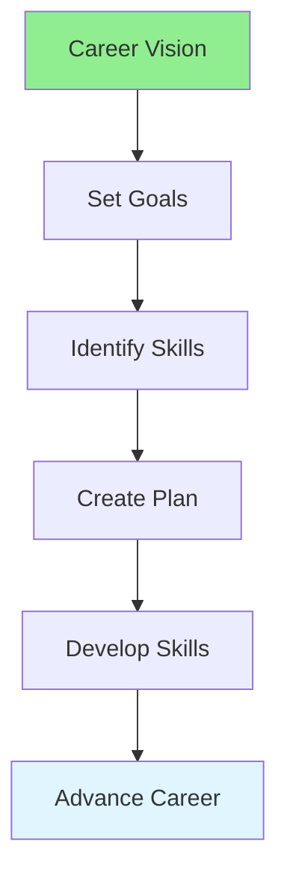

# 12.15 Career Planning / Lập kế hoạch sự nghiệp

## Table of Contents / Mục lục
1. [Introduction / Giới thiệu](#introduction--giới-thiệu)
2. [Career Path / Lộ trình sự nghiệp](#career-path--lộ-trình-sự-nghiệp)
3. [Best Practices / Thực hành tốt nhất](#best-practices--thực-hành-tốt-nhất)
4. [Summary / Tóm tắt](#summary--tóm-tắt)

---

## Introduction / Giới thiệu

### Overview / Tổng quan

**English**: Career planning helps achieve professional goals. Learn to define career objectives, identify required skills, and create a development roadmap.

**Vietnamese**: Lập kế hoạch sự nghiệp giúp đạt mục tiêu chuyên nghiệp. Học cách định nghĩa mục tiêu sự nghiệp, xác định kỹ năng cần thiết và tạo lộ trình phát triển.

### Career Planning Flow / Luồng lập kế hoạch sự nghiệp



---

## Career Path / Lộ trình sự nghiệp

### Example 1: Career Plan / Ví dụ 1: Kế hoạch sự nghiệp

```typescript
// Career plan / Kế hoạch sự nghiệp
interface CareerPlan {
  vision: string;
  shortTerm: CareerGoal[]; // 1-2 years / 1-2 năm
  longTerm: CareerGoal[]; // 3-5 years / 3-5 năm
  requiredSkills: string[];
  developmentPlan: SkillDevelopment[];
}

interface CareerGoal {
  title: string;
  timeline: Date;
  milestones: string[];
}

// Create career plan / Tạo kế hoạch sự nghiệp
function createCareerPlan(vision: string): CareerPlan {
  return {
    vision,
    shortTerm: [],
    longTerm: [],
    requiredSkills: [],
    developmentPlan: []
  };
}
```

---

## Best Practices / Thực hành tốt nhất

1. **Define vision** - Long-term career goal
2. **Set milestones** - Short and long-term goals
3. **Identify skills** - Required competencies
4. **Create plan** - Development roadmap
5. **Review regularly** - Adjust as needed

---

## Summary / Tóm tắt

### Key Takeaways / Điểm chính

- **Vision**: Long-term career goal
- **Goals**: Short and long-term milestones
- **Skills**: Required competencies
- **Plan**: Development roadmap
- **Review**: Regular updates

### Next Steps / Bước tiếp theo

- Complete Group 12: Time Management ✅
- Move to [Group 13: Design Patterns](../Group-13-Design-Patterns/) - Coming next

---

**Last Updated / Cập nhật lần cuối**: 2024

