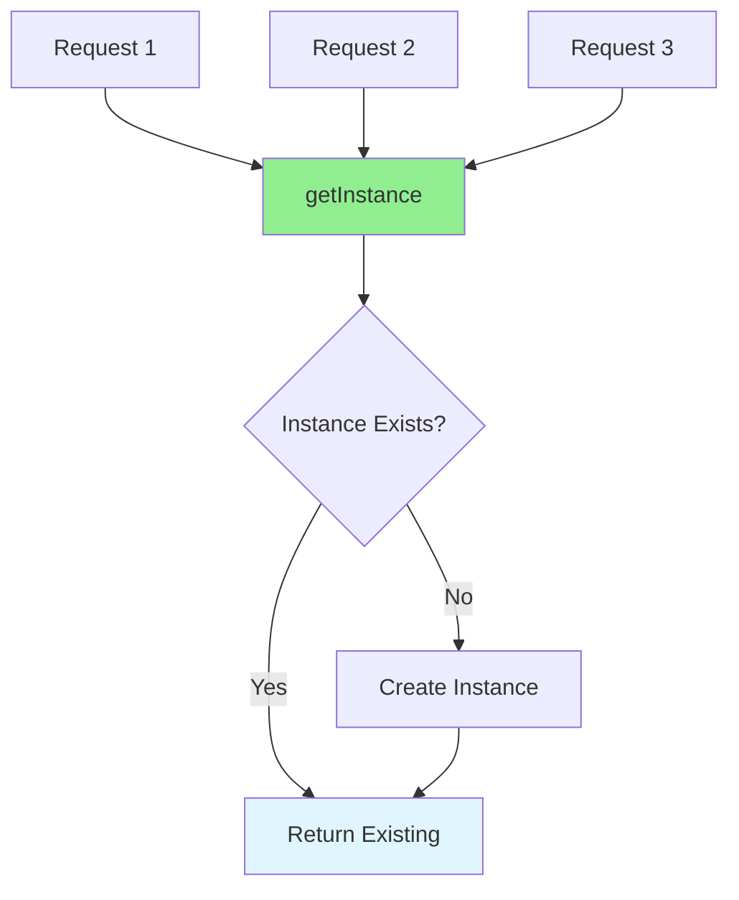

# 13.01 Singleton Pattern / Mẫu Singleton

## Table of Contents / Mục lục
1. [Introduction / Giới thiệu](#introduction--giới-thiệu)
2. [Pattern Structure / Cấu trúc mẫu](#pattern-structure--cấu-trúc-mẫu)
3. [Implementation / Triển khai](#implementation--triển-khai)
4. [Best Practices / Thực hành tốt nhất](#best-practices--thực-hành-tốt-nhất)
5. [Summary / Tóm tắt](#summary--tóm-tắt)

---

## Introduction / Giới thiệu

### Overview / Tổng quan

**English**: Singleton ensures only one instance of a class exists. Learn when and how to implement Singleton pattern correctly.

**Vietnamese**: Singleton đảm bảo chỉ có một instance của class tồn tại. Học khi nào và cách triển khai mẫu Singleton đúng cách.

### Singleton Pattern / Mẫu Singleton



---

## Pattern Structure / Cấu trúc mẫu

### Example 1: Singleton Implementation / Ví dụ 1: Triển khai Singleton

```typescript
// Singleton pattern / Mẫu Singleton
class Singleton {
  private static instance: Singleton;
  
  private constructor() {
    // Private constructor / Constructor riêng tư
  }
  
  public static getInstance(): Singleton {
    if (!Singleton.instance) {
      Singleton.instance = new Singleton();
    }
    return Singleton.instance;
  }
  
  public doSomething(): void {
    console.log('Singleton operation');
  }
}

// Usage / Sử dụng
const instance1 = Singleton.getInstance();
const instance2 = Singleton.getInstance();
console.log(instance1 === instance2); // true
```

---

## Implementation / Triển khai

### Example 2: Thread-Safe Singleton / Ví dụ 2: Singleton an toàn thread

```typescript
// Thread-safe singleton / Singleton an toàn thread
class ThreadSafeSingleton {
  private static instance: ThreadSafeSingleton;
  private static lock = false;
  
  private constructor() {}
  
  public static getInstance(): ThreadSafeSingleton {
    if (!ThreadSafeSingleton.instance) {
      if (!ThreadSafeSingleton.lock) {
        ThreadSafeSingleton.lock = true;
        ThreadSafeSingleton.instance = new ThreadSafeSingleton();
        ThreadSafeSingleton.lock = false;
      }
    }
    return ThreadSafeSingleton.instance;
  }
}
```

---

## Best Practices / Thực hành tốt nhất

1. **Use sparingly** - Only when truly needed
2. **Thread safety** - Consider concurrency
3. **Lazy initialization** - Create on demand
4. **Testing** - Make testable
5. **Alternatives** - Consider dependency injection

---

## Summary / Tóm tắt

### Key Takeaways / Điểm chính

- **Purpose**: Single instance guarantee
- **Implementation**: Private constructor, static method
- **Thread safety**: Consider concurrency
- **Use cases**: Loggers, caches, configuration

### Next Steps / Bước tiếp theo

- [13.02 Factory Pattern](./13.02_Factory_Pattern.md) - Next: Factory Pattern

---

**Last Updated / Cập nhật lần cuối**: 2024

