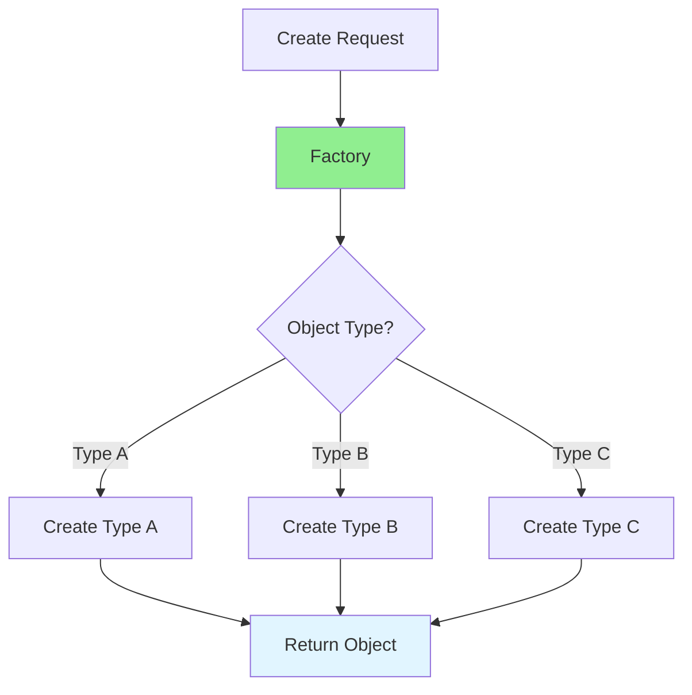

# 13.02 Factory Pattern / Mẫu Factory

## Table of Contents / Mục lục
1. [Introduction / Giới thiệu](#introduction--giới-thiệu)
2. [Pattern Structure / Cấu trúc mẫu](#pattern-structure--cấu-trúc-mẫu)
3. [Implementation / Triển khai](#implementation--triển-khai)
4. [Best Practices / Thực hành tốt nhất](#best-practices--thực-hành-tốt-nhất)
5. [Summary / Tóm tắt](#summary--tóm-tắt)

---

## Introduction / Giới thiệu

### Overview / Tổng quan

**English**: Factory pattern creates objects without specifying exact classes. Learn to use Factory for flexible object creation.

**Vietnamese**: Factory pattern tạo objects mà không chỉ định class cụ thể. Học cách sử dụng Factory cho tạo object linh hoạt.

### Factory Pattern Flow / Luồng Factory Pattern



---

## Pattern Structure / Cấu trúc mẫu

### Example 1: Factory Pattern / Ví dụ 1: Factory Pattern

```typescript
// Factory pattern / Mẫu Factory
interface Product {
  name: string;
  price: number;
}

class ProductFactory {
  static createProduct(type: string): Product {
    switch (type) {
      case 'book':
        return { name: 'Book', price: 20 };
      case 'electronics':
        return { name: 'Electronics', price: 500 };
      default:
        throw new Error(`Unknown product type: ${type}`);
    }
  }
}

// Usage / Sử dụng
const book = ProductFactory.createProduct('book');
const electronics = ProductFactory.createProduct('electronics');
```

---

## Best Practices / Thực hành tốt nhất

1. **Use for complex creation** - When creation logic is complex
2. **Hide implementation** - Encapsulate creation
3. **Extensible** - Easy to add new types
4. **Type safety** - Use TypeScript types
5. **Testable** - Easy to test

---

## Summary / Tóm tắt

### Key Takeaways / Điểm chính

- **Purpose**: Centralized object creation
- **Benefits**: Flexibility and extensibility
- **Use cases**: Complex object creation
- **Implementation**: Factory class/method

### Next Steps / Bước tiếp theo

- [13.03 Builder Pattern](./13.03_Builder_Pattern.md) - Next: Builder Pattern

---

**Last Updated / Cập nhật lần cuối**: 2024


