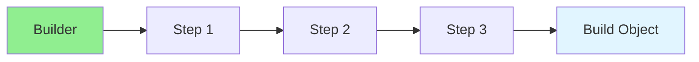

# 13.03 Builder Pattern / Mẫu Builder

## Table of Contents / Mục lục
1. [Introduction / Giới thiệu](#introduction--giới-thiệu)
2. [Pattern Structure / Cấu trúc mẫu](#pattern-structure--cấu-trúc-mẫu)
3. [Implementation / Triển khai](#implementation--triển-khai)
4. [Best Practices / Thực hành tốt nhất](#best-practices--thực-hành-tốt-nhất)
5. [Summary / Tóm tắt](#summary--tóm-tắt)

---

## Introduction / Giới thiệu

### Overview / Tổng quan

**English**: Builder pattern constructs complex objects step by step. Learn to use Builder for flexible object construction.

**Vietnamese**: Builder pattern xây dựng objects phức tạp từng bước. Học cách sử dụng Builder cho xây dựng object linh hoạt.

### Builder Pattern Flow / Luồng Builder Pattern



---

## Pattern Structure / Cấu trúc mẫu

### Example 1: Builder Pattern / Ví dụ 1: Builder Pattern

```typescript
// Builder pattern / Mẫu Builder
class UserBuilder {
  private name?: string;
  private email?: string;
  private age?: number;
  
  setName(name: string): this {
    this.name = name;
    return this;
  }
  
  setEmail(email: string): this {
    this.email = email;
    return this;
  }
  
  setAge(age: number): this {
    this.age = age;
    return this;
  }
  
  build(): User {
    if (!this.name || !this.email) {
      throw new Error('Name and email are required');
    }
    return new User(this.name, this.email, this.age);
  }
}

// Usage / Sử dụng
const user = new UserBuilder()
  .setName('John')
  .setEmail('john@example.com')
  .setAge(30)
  .build();
```

---

## Best Practices / Thực hành tốt nhất

1. **Fluent interface** - Chain methods
2. **Validation** - Validate in build()
3. **Optional parameters** - Make fields optional
4. **Immutability** - Return new instances
5. **Readability** - Clear method names

---

## Summary / Tóm tắt

### Key Takeaways / Điểm chính

- **Purpose**: Step-by-step construction
- **Benefits**: Flexible and readable
- **Use cases**: Complex object creation
- **Implementation**: Fluent interface

### Next Steps / Bước tiếp theo

- [13.04 Observer Pattern](./13.04_Observer_Pattern.md) - Next: Observer Pattern

---

**Last Updated / Cập nhật lần cuối**: 2024


