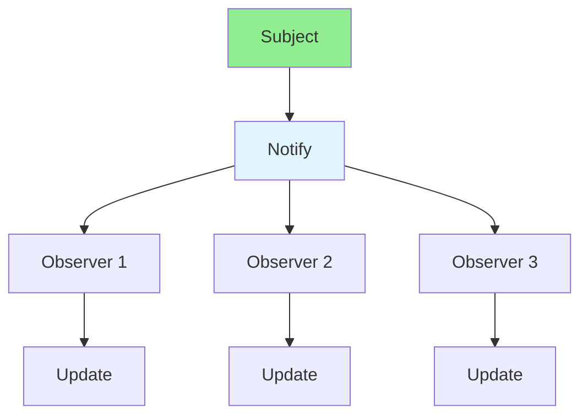

# 13.04 Observer Pattern / Mẫu Observer

## Table of Contents / Mục lục
1. [Introduction / Giới thiệu](#introduction--giới-thiệu)
2. [Pattern Structure / Cấu trúc mẫu](#pattern-structure--cấu-trúc-mẫu)
3. [Implementation / Triển khai](#implementation--triển-khai)
4. [Best Practices / Thực hành tốt nhất](#best-practices--thực-hành-tốt-nhất)
5. [Summary / Tóm tắt](#summary--tóm-tắt)

---

## Introduction / Giới thiệu

### Overview / Tổng quan

**English**: Observer pattern notifies multiple objects about state changes. Learn to implement event-driven communication.

**Vietnamese**: Observer pattern thông báo nhiều objects về thay đổi trạng thái. Học cách triển khai giao tiếp hướng sự kiện.

### Observer Pattern Flow / Luồng Observer Pattern



---

## Pattern Structure / Cấu trúc mẫu

### Example 1: Observer Pattern / Ví dụ 1: Observer Pattern

```typescript
// Observer pattern / Mẫu Observer
interface Observer {
  update(data: any): void;
}

class Subject {
  private observers: Observer[] = [];
  
  attach(observer: Observer): void {
    this.observers.push(observer);
  }
  
  detach(observer: Observer): void {
    this.observers = this.observers.filter(o => o !== observer);
  }
  
  notify(data: any): void {
    this.observers.forEach(observer => observer.update(data));
  }
}

// Usage / Sử dụng
const subject = new Subject();
const observer1 = { update: (data) => console.log('Observer 1:', data) };
const observer2 = { update: (data) => console.log('Observer 2:', data) };

subject.attach(observer1);
subject.attach(observer2);
subject.notify('State changed');
```

---

## Best Practices / Thực hành tốt nhất

1. **Loose coupling** - Subject doesn't know observer details
2. **Event data** - Pass relevant information
3. **Unsubscribe** - Remove observers when done
4. **Error handling** - Handle observer errors
5. **Performance** - Consider large observer lists

---

## Summary / Tóm tắt

### Key Takeaways / Điểm chính

- **Purpose**: Event notification
- **Benefits**: Loose coupling
- **Use cases**: Event systems, UI updates
- **Implementation**: Subject-Observer

### Next Steps / Bước tiếp theo

- [13.05 Strategy Pattern](./13.05_Strategy_Pattern.md) - Next: Strategy Pattern

---

**Last Updated / Cập nhật lần cuối**: 2024


