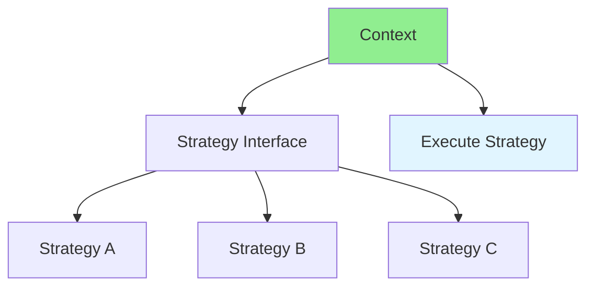

# 13.05 Strategy Pattern / Mẫu Strategy

## Table of Contents / Mục lục
1. [Introduction / Giới thiệu](#introduction--giới-thiệu)
2. [Pattern Structure / Cấu trúc mẫu](#pattern-structure--cấu-trúc-mẫu)
3. [Implementation / Triển khai](#implementation--triển-khai)
4. [Best Practices / Thực hành tốt nhất](#best-practices--thực-hành-tốt-nhất)
5. [Summary / Tóm tắt](#summary--tóm-tắt)

---

## Introduction / Giới thiệu

### Overview / Tổng quan

**English**: Strategy pattern selects algorithms at runtime. Learn to use Strategy for flexible algorithm selection.

**Vietnamese**: Strategy pattern chọn thuật toán tại runtime. Học cách sử dụng Strategy cho lựa chọn thuật toán linh hoạt.

### Strategy Pattern Flow / Luồng Strategy Pattern



---

## Pattern Structure / Cấu trúc mẫu

### Example 1: Strategy Pattern / Ví dụ 1: Strategy Pattern

```typescript
// Strategy pattern / Mẫu Strategy
interface PaymentStrategy {
  pay(amount: number): void;
}

class CreditCardPayment implements PaymentStrategy {
  pay(amount: number): void {
    console.log(`Paid ${amount} with credit card`);
  }
}

class PayPalPayment implements PaymentStrategy {
  pay(amount: number): void {
    console.log(`Paid ${amount} with PayPal`);
  }
}

class PaymentContext {
  private strategy: PaymentStrategy;
  
  constructor(strategy: PaymentStrategy) {
    this.strategy = strategy;
  }
  
  setStrategy(strategy: PaymentStrategy): void {
    this.strategy = strategy;
  }
  
  executePayment(amount: number): void {
    this.strategy.pay(amount);
  }
}

// Usage / Sử dụng
const payment = new PaymentContext(new CreditCardPayment());
payment.executePayment(100);
payment.setStrategy(new PayPalPayment());
payment.executePayment(200);
```

---

## Best Practices / Thực hành tốt nhất

1. **Interface-based** - Use interfaces for strategies
2. **Runtime selection** - Change strategy dynamically
3. **Single responsibility** - Each strategy does one thing
4. **Testable** - Easy to test strategies
5. **Extensible** - Easy to add new strategies

---

## Summary / Tóm tắt

### Key Takeaways / Điểm chính

- **Purpose**: Algorithm selection
- **Benefits**: Flexibility and extensibility
- **Use cases**: Payment methods, sorting algorithms
- **Implementation**: Strategy interface and context

### Next Steps / Bước tiếp theo

- [13.06 Decorator Pattern](./13.06_Decorator_Pattern.md) - Next: Decorator Pattern

---

**Last Updated / Cập nhật lần cuối**: 2024


