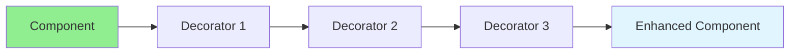

# 13.06 Decorator Pattern / Mẫu Decorator

## Table of Contents / Mục lục
1. [Introduction / Giới thiệu](#introduction--giới-thiệu)
2. [Pattern Structure / Cấu trúc mẫu](#pattern-structure--cấu-trúc-mẫu)
3. [Implementation / Triển khai](#implementation--triển-khai)
4. [Best Practices / Thực hành tốt nhất](#best-practices--thực-hành-tốt-nhất)
5. [Summary / Tóm tắt](#summary--tóm-tắt)

---

## Introduction / Giới thiệu

### Overview / Tổng quan

**English**: Decorator pattern adds behavior to objects dynamically. Learn to use Decorator for flexible feature composition.

**Vietnamese**: Decorator pattern thêm hành vi vào objects động. Học cách sử dụng Decorator cho kết hợp tính năng linh hoạt.

### Decorator Pattern Flow / Luồng Decorator Pattern



---

## Pattern Structure / Cấu trúc mẫu

### Example 1: Decorator Pattern / Ví dụ 1: Decorator Pattern

```typescript
// Decorator pattern / Mẫu Decorator
interface Coffee {
  cost(): number;
  description(): string;
}

class SimpleCoffee implements Coffee {
  cost(): number { return 5; }
  description(): string { return 'Simple coffee'; }
}

class MilkDecorator implements Coffee {
  constructor(private coffee: Coffee) {}
  
  cost(): number { return this.coffee.cost() + 2; }
  description(): string { return this.coffee.description() + ', milk'; }
}

class SugarDecorator implements Coffee {
  constructor(private coffee: Coffee) {}
  
  cost(): number { return this.coffee.cost() + 1; }
  description(): string { return this.coffee.description() + ', sugar'; }
}

// Usage / Sử dụng
let coffee: Coffee = new SimpleCoffee();
coffee = new MilkDecorator(coffee);
coffee = new SugarDecorator(coffee);
console.log(coffee.description()); // Simple coffee, milk, sugar
console.log(coffee.cost()); // 8
```

---

## Best Practices / Thực hành tốt nhất

1. **Composition** - Compose behaviors
2. **Transparency** - Decorator implements same interface
3. **Order matters** - Decorator order affects result
4. **Avoid deep nesting** - Keep reasonable depth
5. **Performance** - Consider overhead

---

## Summary / Tóm tắt

### Key Takeaways / Điểm chính

- **Purpose**: Add behavior dynamically
- **Benefits**: Flexible composition
- **Use cases**: Middleware, feature flags
- **Implementation**: Wrapper classes

### Next Steps / Bước tiếp theo

- [13.07 Adapter Pattern](./13.07_Adapter_Pattern.md) - Next: Adapter Pattern

---

**Last Updated / Cập nhật lần cuối**: 2024


