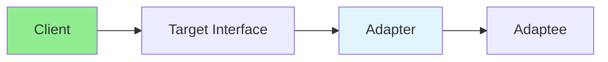

# 13.07 Adapter Pattern / Mẫu Adapter

## Table of Contents / Mục lục
1. [Introduction / Giới thiệu](#introduction--giới-thiệu)
2. [Pattern Structure / Cấu trúc mẫu](#pattern-structure--cấu-trúc-mẫu)
3. [Implementation / Triển khai](#implementation--triển-khai)
4. [Best Practices / Thực hành tốt nhất](#best-practices--thực-hành-tốt-nhất)
5. [Summary / Tóm tắt](#summary--tóm-tắt)

---

## Introduction / Giới thiệu

### Overview / Tổng quan

**English**: Adapter pattern makes incompatible interfaces work together. Learn to use Adapter for integrating different systems.

**Vietnamese**: Adapter pattern làm cho các interface không tương thích hoạt động cùng nhau. Học cách sử dụng Adapter để tích hợp các hệ thống khác nhau.

### Adapter Pattern Flow / Luồng Adapter Pattern



---

## Pattern Structure / Cấu trúc mẫu

### Example 1: Adapter Pattern / Ví dụ 1: Adapter Pattern

```typescript
// Adapter pattern / Mẫu Adapter
interface Target {
  request(): string;
}

class Adaptee {
  specificRequest(): string {
    return 'Adaptee specific request';
  }
}

class Adapter implements Target {
  constructor(private adaptee: Adaptee) {}
  
  request(): string {
    return this.adaptee.specificRequest();
  }
}

// Usage / Sử dụng
const adaptee = new Adaptee();
const adapter = new Adapter(adaptee);
console.log(adapter.request());
```

---

## Best Practices / Thực hành tốt nhất

1. **Interface compatibility** - Match target interface
2. **Minimal changes** - Don't modify adaptee
3. **Transparency** - Client doesn't know adapter
4. **Reusability** - Reuse adapters
5. **Performance** - Consider overhead

---

## Summary / Tóm tắt

### Key Takeaways / Điểm chính

- **Purpose**: Interface compatibility
- **Benefits**: Integration without modification
- **Use cases**: Third-party libraries, legacy code
- **Implementation**: Wrapper class

### Next Steps / Bước tiếp theo

- [13.08 Facade Pattern](./13.08_Facade_Pattern.md) - Next: Facade Pattern

---

**Last Updated / Cập nhật lần cuối**: 2024


