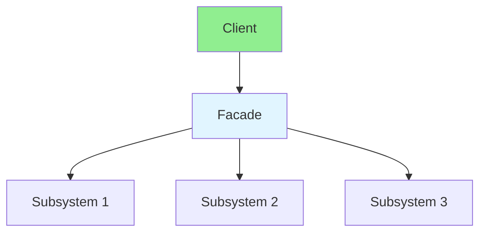

# 13.08 Facade Pattern / Mẫu Facade

## Table of Contents / Mục lục
1. [Introduction / Giới thiệu](#introduction--giới-thiệu)
2. [Pattern Structure / Cấu trúc mẫu](#pattern-structure--cấu-trúc-mẫu)
3. [Implementation / Triển khai](#implementation--triển-khai)
4. [Best Practices / Thực hành tốt nhất](#best-practices--thực-hành-tốt-nhất)
5. [Summary / Tóm tắt](#summary--tóm-tắt)

---

## Introduction / Giới thiệu

### Overview / Tổng quan

**English**: Facade provides a simplified interface to a complex subsystem. Learn to use Facade for easier system interaction.

**Vietnamese**: Facade cung cấp interface đơn giản cho subsystem phức tạp. Học cách sử dụng Facade cho tương tác hệ thống dễ dàng hơn.

### Facade Pattern Flow / Luồng Facade Pattern



---

## Pattern Structure / Cấu trúc mẫu

### Example 1: Facade Pattern / Ví dụ 1: Facade Pattern

```typescript
// Facade pattern / Mẫu Facade
class SubsystemA {
  operationA(): string { return 'A'; }
}

class SubsystemB {
  operationB(): string { return 'B'; }
}

class SubsystemC {
  operationC(): string { return 'C'; }
}

class Facade {
  private a = new SubsystemA();
  private b = new SubsystemB();
  private c = new SubsystemC();
  
  operation(): string {
    return `${this.a.operationA()}${this.b.operationB()}${this.c.operationC()}`;
  }
}

// Usage / Sử dụng
const facade = new Facade();
console.log(facade.operation()); // ABC
```

---

## Best Practices / Thực hành tốt nhất

1. **Simplify** - Hide complexity
2. **Single entry point** - One facade per subsystem
3. **Don't hide everything** - Allow direct access when needed
4. **Layer facades** - Can have multiple levels
5. **Documentation** - Document facade methods

---

## Summary / Tóm tắt

### Key Takeaways / Điểm chính

- **Purpose**: Simplified interface
- **Benefits**: Easier to use
- **Use cases**: Complex APIs, libraries
- **Implementation**: Wrapper class

### Next Steps / Bước tiếp theo

- [13.09 Command Pattern](./13.09_Command_Pattern.md) - Next: Command Pattern

---

**Last Updated / Cập nhật lần cuối**: 2024

