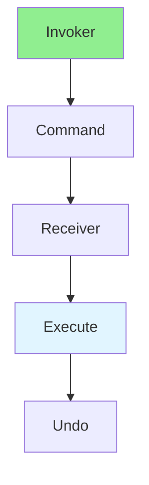

# 13.09 Command Pattern / Mẫu Command

## Table of Contents / Mục lục
1. [Introduction / Giới thiệu](#introduction--giới-thiệu)
2. [Pattern Structure / Cấu trúc mẫu](#pattern-structure--cấu-trúc-mẫu)
3. [Implementation / Triển khai](#implementation--triển-khai)
4. [Best Practices / Thực hành tốt nhất](#best-practices--thực-hành-tốt-nhất)
5. [Summary / Tóm tắt](#summary--tóm-tắt)

---

## Introduction / Giới thiệu

### Overview / Tổng quan

**English**: Command pattern encapsulates requests as objects. Learn to use Command for undo/redo, queuing, and logging operations.

**Vietnamese**: Command pattern đóng gói requests như objects. Học cách sử dụng Command cho undo/redo, xếp hàng và ghi log operations.

### Command Pattern Flow / Luồng Command Pattern



---

## Pattern Structure / Cấu trúc mẫu

### Example 1: Command Pattern / Ví dụ 1: Command Pattern

```typescript
// Command pattern / Mẫu Command
interface Command {
  execute(): void;
  undo(): void;
}

class Light {
  on(): void { console.log('Light on'); }
  off(): void { console.log('Light off'); }
}

class LightOnCommand implements Command {
  constructor(private light: Light) {}
  
  execute(): void { this.light.on(); }
  undo(): void { this.light.off(); }
}

class RemoteControl {
  private command: Command | null = null;
  
  setCommand(command: Command): void {
    this.command = command;
  }
  
  pressButton(): void {
    this.command?.execute();
  }
}

// Usage / Sử dụng
const light = new Light();
const command = new LightOnCommand(light);
const remote = new RemoteControl();
remote.setCommand(command);
remote.pressButton();
```

---

## Best Practices / Thực hành tốt nhất

1. **Encapsulation** - Encapsulate requests
2. **Undo/redo** - Implement undo capability
3. **Queuing** - Queue commands for later
4. **Logging** - Log commands for audit
5. **Macro commands** - Combine commands

---

## Summary / Tóm tắt

### Key Takeaways / Điểm chính

- **Purpose**: Encapsulate requests
- **Benefits**: Undo/redo, queuing, logging
- **Use cases**: UI actions, transactions
- **Implementation**: Command interface

### Next Steps / Bước tiếp theo

- [13.10 Repository Pattern](./13.10_Repository_Pattern.md) - Next: Repository Pattern

---

**Last Updated / Cập nhật lần cuối**: 2024


