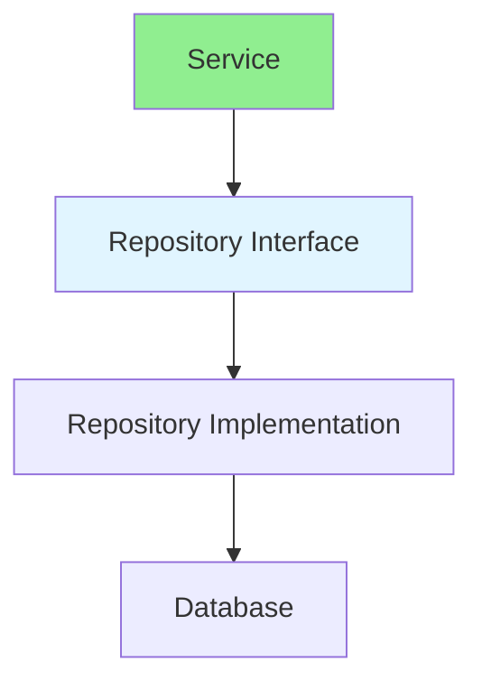

# 13.10 Repository Pattern / Mẫu Repository

## Table of Contents / Mục lục
1. [Introduction / Giới thiệu](#introduction--giới-thiệu)
2. [Pattern Structure / Cấu trúc mẫu](#pattern-structure--cấu-trúc-mẫu)
3. [Implementation / Triển khai](#implementation--triển-khai)
4. [Best Practices / Thực hành tốt nhất](#best-practices--thực-hành-tốt-nhất)
5. [Summary / Tóm tắt](#summary--tóm-tắt)

---

## Introduction / Giới thiệu

### Overview / Tổng quan

**English**: Repository pattern abstracts data access. Learn to use Repository for clean separation between business logic and data access.

**Vietnamese**: Repository pattern trừu tượng hóa truy cập dữ liệu. Học cách sử dụng Repository cho tách biệt sạch giữa business logic và truy cập dữ liệu.

### Repository Pattern Flow / Luồng Repository Pattern



---

## Pattern Structure / Cấu trúc mẫu

### Example 1: Repository Pattern / Ví dụ 1: Repository Pattern

```typescript
// Repository pattern / Mẫu Repository
interface Repository<T> {
  findById(id: string): Promise<T | null>;
  findAll(): Promise<T[]>;
  create(entity: T): Promise<T>;
  update(id: string, entity: Partial<T>): Promise<T>;
  delete(id: string): Promise<void>;
}

class UserRepository implements Repository<User> {
  async findById(id: string): Promise<User | null> {
    return await prisma.user.findUnique({ where: { id } });
  }
  
  async findAll(): Promise<User[]> {
    return await prisma.user.findMany();
  }
  
  async create(user: User): Promise<User> {
    return await prisma.user.create({ data: user });
  }
  
  async update(id: string, data: Partial<User>): Promise<User> {
    return await prisma.user.update({ where: { id }, data });
  }
  
  async delete(id: string): Promise<void> {
    await prisma.user.delete({ where: { id } });
  }
}
```

---

## Best Practices / Thực hành tốt nhất

1. **Interface-based** - Use interfaces
2. **Generic** - Make reusable
3. **Testable** - Easy to mock
4. **Separation** - Isolate data access
5. **Consistency** - Standard operations

---

## Summary / Tóm tắt

### Key Takeaways / Điểm chính

- **Purpose**: Data access abstraction
- **Benefits**: Testability and separation
- **Use cases**: Data persistence
- **Implementation**: Interface and implementation

### Next Steps / Bước tiếp theo

- [13.11 Dependency Injection](./13.11_Dependency_Injection.md) - Next: Dependency Injection

---

**Last Updated / Cập nhật lần cuối**: 2024


