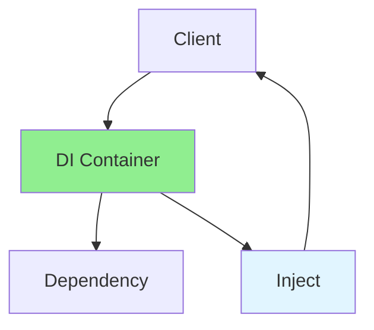

# 13.11 Dependency Injection / Dependency Injection

## Table of Contents / Mục lục
1. [Introduction / Giới thiệu](#introduction--giới-thiệu)
2. [DI Concepts / Khái niệm DI](#di-concepts--khái-niệm-di)
3. [Implementation / Triển khai](#implementation--triển-khai)
4. [Best Practices / Thực hành tốt nhất](#best-practices--thực-hành-tốt-nhất)
5. [Summary / Tóm tắt](#summary--tóm-tắt)

---

## Introduction / Giới thiệu

### Overview / Tổng quan

**English**: Dependency Injection provides dependencies from outside. Learn to use DI for loose coupling and testability.

**Vietnamese**: Dependency Injection cung cấp dependencies từ bên ngoài. Học cách sử dụng DI cho loose coupling và testability.

### Dependency Injection Flow / Luồng Dependency Injection



---

## DI Concepts / Khái niệm DI

### Example 1: Dependency Injection / Ví dụ 1: Dependency Injection

```typescript
// Dependency injection / Dependency Injection
interface EmailService {
  send(email: string, message: string): void;
}

class SMTPEmailService implements EmailService {
  send(email: string, message: string): void {
    console.log(`Sending email to ${email}: ${message}`);
  }
}

class UserService {
  constructor(private emailService: EmailService) {}
  
  registerUser(email: string): void {
    // Register user logic / Logic đăng ký user
    this.emailService.send(email, 'Welcome!');
  }
}

// Usage / Sử dụng
const emailService = new SMTPEmailService();
const userService = new UserService(emailService);
userService.registerUser('user@example.com');
```

---

## Best Practices / Thực hành tốt nhất

1. **Use interfaces** - Program to interfaces
2. **Constructor injection** - Inject via constructor
3. **DI container** - Use framework DI
4. **Testability** - Easy to mock
5. **Loose coupling** - Depend on abstractions

---

## Summary / Tóm tắt

### Key Takeaways / Điểm chính

- **Purpose**: Loose coupling
- **Benefits**: Testability and flexibility
- **Use cases**: Service dependencies
- **Implementation**: Constructor/property injection

### Next Steps / Bước tiếp theo

- [13.12 MVC Pattern](./13.12_MVC_Pattern.md) - Next: MVC Pattern

---

**Last Updated / Cập nhật lần cuối**: 2024

