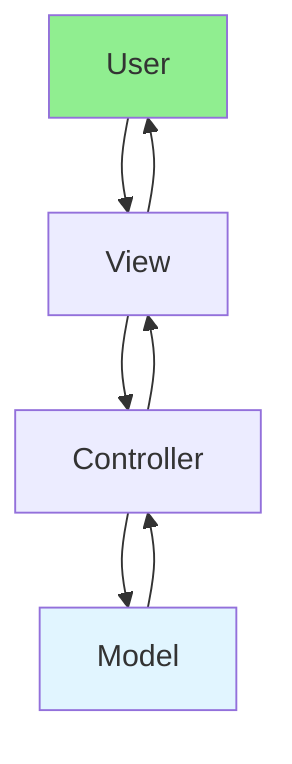

# 13.12 MVC Pattern / Mẫu MVC

## Table of Contents / Mục lục
1. [Introduction / Giới thiệu](#introduction--giới-thiệu)
2. [MVC Components / Thành phần MVC](#mvc-components--thành-phần-mvc)
3. [Implementation / Triển khai](#implementation--triển-khai)
4. [Best Practices / Thực hành tốt nhất](#best-practices--thực-hành-tốt-nhất)
5. [Summary / Tóm tắt](#summary--tóm-tắt)

---

## Introduction / Giới thiệu

### Overview / Tổng quan

**English**: MVC separates application into Model, View, and Controller. Learn to implement MVC for organized code structure.

**Vietnamese**: MVC tách ứng dụng thành Model, View và Controller. Học cách triển khai MVC cho cấu trúc code có tổ chức.

### MVC Pattern Flow / Luồng MVC Pattern



---

## MVC Components / Thành phần MVC

### Example 1: MVC Pattern / Ví dụ 1: MVC Pattern

```typescript
// MVC pattern / Mẫu MVC
// Model / Model
class UserModel {
  private users: User[] = [];
  
  getUsers(): User[] {
    return this.users;
  }
  
  addUser(user: User): void {
    this.users.push(user);
  }
}

// View / View
class UserView {
  displayUsers(users: User[]): void {
    users.forEach(user => console.log(user.name));
  }
}

// Controller / Controller
class UserController {
  constructor(
    private model: UserModel,
    private view: UserView
  ) {}
  
  addUser(name: string): void {
    this.model.addUser({ name });
    this.view.displayUsers(this.model.getUsers());
  }
}
```

---

## Best Practices / Thực hành tốt nhất

1. **Separation** - Clear boundaries
2. **Model logic** - Business logic in model
3. **View simplicity** - Keep views simple
4. **Controller thin** - Minimal logic
5. **Communication** - Proper data flow

---

## Summary / Tóm tắt

### Key Takeaways / Điểm chính

- **Components**: Model, View, Controller
- **Separation**: Clear responsibilities
- **Flow**: User → View → Controller → Model
- **Benefits**: Organized and maintainable

### Next Steps / Bước tiếp theo

- [13.13 MVP Pattern](./13.13_MVP_Pattern.md) - Next: MVP Pattern

---

**Last Updated / Cập nhật lần cuối**: 2024

