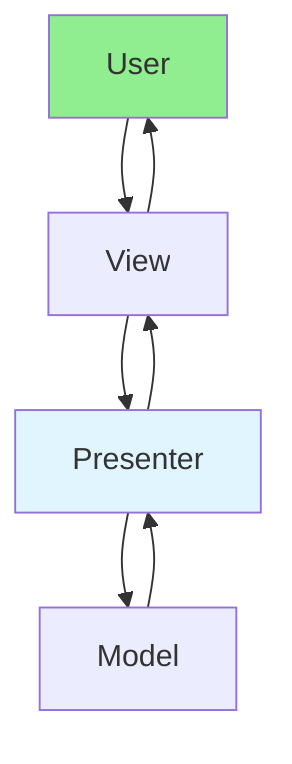

# 13.13 MVP Pattern / Mẫu MVP

## Table of Contents / Mục lục
1. [Introduction / Giới thiệu](#introduction--giới-thiệu)
2. [MVP Components / Thành phần MVP](#mvp-components--thành-phần-mvp)
3. [Implementation / Triển khai](#implementation--triển-khai)
4. [Best Practices / Thực hành tốt nhất](#best-practices--thực-hành-tốt-nhất)
5. [Summary / Tóm tắt](#summary--tóm-tắt)

---

## Introduction / Giới thiệu

### Overview / Tổng quan

**English**: MVP (Model-View-Presenter) separates presentation logic. Learn to implement MVP for testable UI code.

**Vietnamese**: MVP (Model-View-Presenter) tách logic trình bày. Học cách triển khai MVP cho code UI có thể kiểm thử.

### MVP Pattern Flow / Luồng MVP Pattern



---

## MVP Components / Thành phần MVP

### Example 1: MVP Pattern / Ví dụ 1: MVP Pattern

```typescript
// MVP pattern / Mẫu MVP
// Model / Model
class UserModel {
  getUsers(): User[] {
    return [];
  }
}

// View / View
interface IUserView {
  showUsers(users: User[]): void;
  showError(message: string): void;
}

// Presenter / Presenter
class UserPresenter {
  constructor(
    private model: UserModel,
    private view: IUserView
  ) {}
  
  loadUsers(): void {
    try {
      const users = this.model.getUsers();
      this.view.showUsers(users);
    } catch (error) {
      this.view.showError('Failed to load users');
    }
  }
}
```

---

## Best Practices / Thực hành tốt nhất

1. **View interface** - Use interfaces for views
2. **Presenter logic** - Presentation logic in presenter
3. **Testable** - Easy to test presenter
4. **Separation** - Clear boundaries
5. **Communication** - View calls presenter

---

## Summary / Tóm tắt

### Key Takeaways / Điểm chính

- **Components**: Model, View, Presenter
- **Presenter**: Handles presentation logic
- **Testability**: Easy to test
- **Benefits**: Better than MVC for testing

### Next Steps / Bước tiếp theo

- [13.14 MVVM Pattern](./13.14_MVVM_Pattern.md) - Next: MVVM Pattern

---

**Last Updated / Cập nhật lần cuối**: 2024

